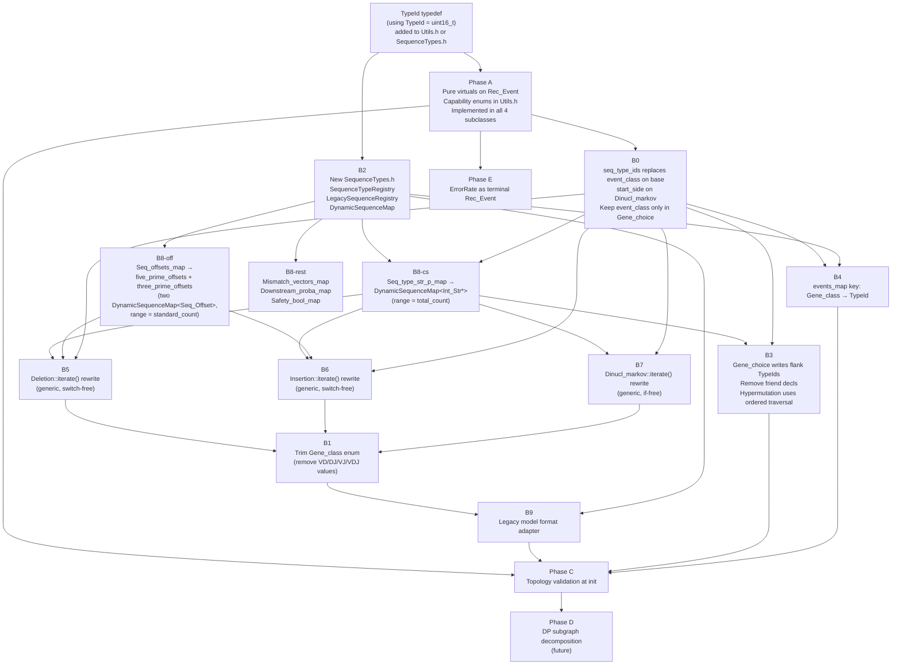

# Rec_Event Capability Attributes & Gene_class Correction: Architectural Refactoring Plan

**Last Updated**: August 26, 2026

---

## Implementation Status (audited Aug 26 2026; baseline re-checked against `develop` @ `ed5c583`, Aug 27 2026)

Legend: ✅ done · 🟡 partial · ⬜ not started

| Task | Status | Notes |
|------|:------:|-------|
| Phase A | ⬜ | No capability enums, no pure virtuals. Nothing named `is_branching`, `SeqConstructionRole`, `OffsetRole`, `SeqContextDependency` exists anywhere in the tree. |
| B0 | 🟡 | `Rec_Event` gained a `Seq_type_String seq_type` **string** member; `event_class` was **kept** on the base. No `seq_type_ids` vector, no `primary_seq_type_id()`. Subclasses gained typed members (`Deletion::target_seq_type`, `Insertion::ins_seq_type`, `Dinucl_markov::ins_seq_type`). `Dinucl_markov::start_side` realised as `DinuclTraversalSpec::anchor_side` + `event_side`. |
| B1 | ✅ | `Gene_class` = `{V_gene, D_gene, J_gene, Undefined_gene}`. Junction values moved to a new `Gene_class_legacy` enum confined to file I/O + `gene_to_seqtype_migr` module. |
| B2 | 🟡 | `SeqTypeRegistry.h` provides the **ordering** and left/right neighbour lookup only — keyed by `std::string`, not `TypeId`. No `register_type`/`get_type_id`/`freeze`/`standard_count`, no flank types, and **no `DynamicSequenceMap` at all**. |
| B3 | ⬜ | No flank seq types. `Gene_choice` friend declarations for `Hypermutation_*` still present. |
| B4 | ✅ | `Events_map = unordered_map<tuple<Event_type, Seq_type_String, Seq_side>, shared_ptr<Rec_Event>>`, threaded through every `iterate`/`initialize_event`/counter/error-rate signature. Key built from `get_seq_type()`. Tandem-D uniqueness achieved. |
| B5 | ⬜ | `Deletion::iterate()` still carries the full 4-case switch (now on `target_seq_type` instead of `event_class`) and the hardcoded `VD_safe`/`DJ_safe`/`VJ_safe` checks. |
| B6 | ⬜ | `Insertion::iterate()` still branches per junction — the `switch(event_class)` became an `if/else` chain of `std::string` comparisons on `this->seq_type`. |
| B7 | 🟡 | The `if (event_class == …)` chain is gone from `iterate()`; anchor sequence + anchor side are now data (`DinuclTraversalSpec`). But the specs come from a hardcoded `switch(Seq_type)` at construction, not from registry traversal, and there is no skip-empty walk. |
| B8 | ⬜ | `Seq_type_str_p_map`, `Seq_offsets_map`, `Mismatch_vectors_map`, `Downstream_scenario_proba_bound_map` unchanged; `Safety_bool_map` still keyed by the `Event_safety` enum. A `Str_Dual_key_memory_map` / `Str_Seq_offsets_map` prototype was added to `Utils.h` but is referenced only from tests. |
| B11 *(new)* | ⬜ | Generalize `Gene_choice` seq_type writes (both the alignment and `no_d_align` exhaustive paths). **Most blocking item for milestone 1** — two D events currently both write `D_gene_seq`. |
| B10 *(new)* | ⬜ | Absent-segment semantics. **Off the tandem-D critical path** — milestone 1 has both D genes always present. Carries a real modelling decision (chain-with-conflation vs. DAG ordering) deferred to milestone 2. |
| B9 | 🟡 | Legacy→seq_type inference, registry inference (VDJ/VJ), `write_model_parms_legacy` / `write_model_parms_v2` split, v2 `@Version` / `@Seq_type_order` parsing and per-event `write2txt_v2()` are all implemented. `VDJ_genes` `Dinucl_markov` expansion (B9 step 3) and junction safety adjacency generation (step 4) are not. |
| Phase C | ⬜ | — |
| Phase D | ⬜ | — |
| Phase E | ⬜ | — |

## Execution plan (as of `ed5c583`, Aug 27 2026)

### Baseline

`feature/modelfileformat` is **merged into `develop`** (`e924bb6`, squash-merged — an ancestry check
against the branch tip still reports "not an ancestor"; the code is in the tree). `develop` also
carries `ed5c583` (PR #66, legacy aligner refactor: `Alignment_data` API change, categorized
mismatches, CIGAR support). `feature/tandemD` is level with `develop`. The status table above
therefore describes **`develop`**, not a side branch.

Three items did **not** come along with the merge and are live on `develop` today:
deviation 3 (`test_model_format_v2.cpp` in no `CMakeLists.txt`), deviation 8 (`Model_Parms` copy
constructor drops `seq_type_registry`), and hazard H1 (legacy 19-parameter `iterate()` still
declared at `Rec_Event.h:154`).

The five test-infrastructure commits formerly on `feature/tandemD` (`a468bd4`…`1347521` — Contexts
based iterate tests, mocking harness) are preserved on `feature/2_unittests`. Nothing lost.

### Step 0 — prerequisites

| # | Task | Lands on | Rationale |
|---|---|---|---|
| 0.1 | `Model_Parms` copy ctor copies `seq_type_registry` (deviation 8) | `feature/tandemD` | modelfileformat follow-up, directly serving tandem D |
| 0.2 | Wire `test_model_format_v2.cpp` into CMake; tandem cases `[!mayfail]` (deviation 3) | `feature/tandemD` | same |
| 0.3 | Delete the legacy `iterate()` / `iterate_wrap_up()` overloads (H1) | **`develop`** | broad cleanup benefiting every branch; removes the worst `feature/AA_PGEN` collision |
| 0.4 | Test-infra commits | *no action* | already on `feature/2_unittests` |

### Step 0b — AA Pgen salvage window (time-boxed)

`feature/AA_PGEN` is 21 commits ahead of / 14 behind `develop` and **no longer compiles against it**:
it references `VD_genes`/`DJ_genes`/`VJ_genes`/`VDJ_genes` as `Gene_class` values 25 times in
`Dinuclmarkov.cpp` and 27 times in `Insertion.cpp`, and B1 moved those to `Gene_class_legacy`. PR #66
adds a second axis of drift through the `Alignment_data` API. That debt is accruing now.

Cherry-pick the **refactor-neutral** subset onto `develop` while it still applies cleanly — verified
free of references to the removed enum values:

- `JournaledQuery.{h,cpp}` (new files)
- `EventUtils` codon utilities, `CodonMask`, `popcountll` (§8.1 tests pass)
- `QuerySequenceContext` extension (AA plan Phase 3)
- **`Enum_fast_memory_map::set_value` growth fix (`a1ac166`) + regression test** — must be on
  `develop` and covered *before* B8 replaces the class (hazard H2)
- `Errorrate.h` `int` → `size_t`
- `Pruning_mismatch_floor_map` typedef + `ExplorationContext` member — take the arity change once,
  now, so B8 only ever changes types (hazard H4)

Everything iterate-resident (AA plan Phases 4–7) stays on its branch and is **re-derived** on top of
the refactor, not merged. Per that plan's own Part II those parts are incorrect in eight documented
ways and untested against production code, so there is no working behaviour to preserve — and B5/B7
collapse the ×3 VD/DJ/VJ duplication that its follow-up item #14 exists to fix.

Also worth checking before anyone re-implements it: PR #66's categorized/extended mismatch tracking
may already satisfy AA plan item §10.4.3 ("dual-track output from `sw_align`, or a re-scan").

### Step 1 — tandem-D critical path

**Milestone 1 (both D genes always present)**: `B2`-with-TypeId → `B8` → **`B11`** → `B7` → `B6` → `B5` → tandem-D model + round-trip test. B10 is **not** required — the traversal never skips a segment.

Milestone 1 runs on a **dummy generative model, not real biological data**. What it validates: structural correctness (registry ordering, `events_map` uniqueness, seq_type-driven writes, generic neighbour-based insertion lengths, generic Dinucl seeding) and the compute-time cost of a second D. What it does **not** validate: aligner behaviour on real tandem-D receptors, the `no_d_align` fallback in practice, or inference quality on biological repertoires.

- **Correctness criterion**: reuse the existing round-trip harness — `TEST_CASE("Inference recovers ground truth model - smoke" / "- convergence")` in [tst/igor/Core/test_inference.cpp](tst/igor/Core/test_inference.cpp) with [tst/igor/entropy_test_helpers.h](tst/igor/entropy_test_helpers.h). Generate from a known dummy tandem-D model, infer, check the marginals converge back.
- **Compute-time criterion**: the pre-pruning scenario count grows by roughly `N_D2 × Δ_D2_5' × Δ_D2_3'` versus the equivalent single-D model. Keep the milestone-1 fixture small (one or two D2 templates, narrow deletion ranges) so the round-trip stays fast, and measure the ratio against a matched VDJ model rather than in absolute terms.

**Milestone 2 (optional D2)**: `B10`, including the chain-vs-DAG decision recorded there.

Not on the path, deliberately deferred: B3 (flanks), B9 steps 3–4, Phase A, Phase C, Phases D/E.

Build in while passing through, both nearly free now and expensive to retrofit:

- **The two-track mismatch seam** in the generic `Deletion` / `Gene_choice` position loops (hazard
  H5). In NT mode floor == upper, so *alias* one vector rather than copying — this both avoids the
  per-call copy the AA plan flags in its §10.4.4 and leaves AA Pgen's Phase 4 essentially done, in
  one place instead of three.
- **Do not design out the reading-frame dependency** (hazard H8) — keep seq_type and offset
  information reachable in B5/B7 rather than collapsing it early.

### Step 2 — hand back

AA Pgen resumes on the refactored substrate: `iterate_patched_pgen` on `traversal_specs`,
`Single_error_rate` on registry ordering, two-track already wired.

### Deviations found in the implementation

Each is resolved in **Design decisions** below; the tag on each entry says how.

1. **`TypeId` was never introduced; `Seq_type_String` (`std::string`) took its place.**
   The plan's whole B2/B8 layer rests on TypeId being a *dense integer in `[0, count)`* so that
   `storage_[id + layer * count_]` is pure integer arithmetic and `find_first_nonempty_left` is an
   O(1) indexed walk. The implemented registry has no id allocation at all — it stores
   `vector<string>` + `unordered_map<string,size_t>`, and `Events_map` hashes a `std::string` per
   lookup. B2/B8 as written cannot be built on top of this.
   → **Resolved in D1: adopt a hybrid.** The registry gains a `TypeId` allocation layer; names stay
   as the serialization identity and remain the `Events_map` key. B2's `SequenceTypeRegistry` sketch
   is superseded by the revised `SeqTypeRegistry` in D1.

2. **`Seq_type` is still the fixed 6-value enum, and it is still the runtime key.**
   `Deletion`, `Insertion` and `Dinucl_markov` all store a `Seq_type` and all the scenario maps are
   still `Enum_fast_memory_map<Seq_type, …>`. `str2SeqType()` throws on anything outside the six
   legacy names — so the v2 tandem-D parms file in `tst/test_data/format_v2/test_v2_tandem_d_parms.txt`
   (`D1_gene_seq`, `VD1_ins_seq`, …) **cannot actually be loaded**: `read_model_parms()` calls
   `new Deletion(str2SeqType("D1_gene_seq"), …)` and throws. The registry accepts the ordering, but
   no event can be constructed for it. The v2 format is therefore only end-to-end functional for
   models expressible in the legacy 6 seq_types.
   → **Resolved in D2.** Tandem D is independent of Phase A; it is gated on B2-with-TypeId → B8 →
   B7/B6/B5. Sequencing is given in D2.

3. **`tst/test_model_format_v2.cpp` (981 lines) is not registered in any `CMakeLists.txt`** and is
   never compiled or run. That includes every tandem-D test, so the claims above are untested rather
   than failing. This should be wired up (and the tandem cases marked as expected-to-fail) before
   anything else in Phase B lands.
   → **Accepted; owner to fix.** Still live on `develop` @ `ed5c583` — scheduled as Step 0.2 on `feature/tandemD`.

4. **Hot-path string comparisons.** `Insertion::iterate()`, `Insertion::has_effect_on()`,
   `Dinucl_markov::has_effect_on()` and `Dinucl_markov::iterate_initialize_Len_proba()` now dispatch
   on `this->seq_type` via `std::string` equality, inside the per-scenario traversal. This is a
   throughput regression relative to the enum switch it replaced, and it is exactly the code B5–B7
   are supposed to delete.
   → **Resolved in D4: accepted as transient, no action.** These sites are below measurement noise —
   `Insertion::iterate()` does at most three short-string compares per node on a perfectly predicted
   branch, and the other two are init-time. B5/B6/B7 delete them anyway. The measurement that does
   matter is B8's; the protocol is in D4.

5. **`Str_Dual_key_memory_map` contradicts B8's design.** It is
   `unordered_map<string, unordered_map<int, {vector<V>, int}>>` — two hash lookups and a pointer
   chase per access, versus the flat `V*` + `int*` arrays the plan specifies. If it is intended as
   the future `Seq_offsets_map`, the plan's performance premise is lost.
   → **Resolved in D1: delete it**, and implement `DynamicSequenceMap` keyed by `TypeId` per B2/D1.
   D4 step 1 benchmarks it against the alternatives first, so the decision is recorded with numbers.

6. **`event_class` was kept on `Rec_Event` rather than pushed down into `Gene_choice`.**
   Non-`Gene_choice` events now carry `Undefined_gene`, and `Deletion` reconstructs a `Gene_class`
   from its `Seq_type` (`get_deletion_gene_class()`) purely to satisfy the base constructor. B0's
   stated goal — `Gene_class` surviving only where alignment strategy is dispatched — is not met.
   → **Accepted as a temporary bridge.** All such legacy translation is to be consolidated into the
   v1→v2 migration module (`gene_to_seqtype_migr`) rather than living in event constructors, and
   `event_class` pushed down into `Gene_choice` when B0 is completed.

7. **Positive deviations worth keeping.** Splitting `Gene_class_legacy` out as a separate enum
   (rather than deleting the junction values outright, as B1 says) cleanly isolates the file-format
   boundary and should be adopted into the plan. Likewise `write2txt_legacy()` / `write2txt_v2()` and
   `requires_extended_format()` are a better round-trip story than B9 described.

8. **`Model_Parms` copy constructor drops `seq_type_registry`** —
   [Model_Parms.cpp:63-97](src/igor/Core/Model_Parms.cpp#L63-L97) copies events, edges and
   `error_rate` only. Every thread-local `Model_Parms` in the inference OpenMP region therefore
   holds an empty registry. Latent today, but it already misroutes `write_model_parms()` on a copied
   `Model_Parms` (an empty registry makes `requires_extended_format()` return `false`, silently
   downgrading a v2 model to legacy format on write).
   → **Prerequisite bug; must be fixed before B2.** See D1b. Still live on `develop` @ `ed5c583` — scheduled as Step 0.1 on `feature/tandemD`.

### Design decisions taken on these deviations (Aug 26 2026)

#### D1 — Names and TypeIds coexist: `std::string` is the identity, `TypeId` is the handle

**Decision: adopt a hybrid. Do not choose one representation.**

Measured facts that drove this:

- Every `Events_map` lookup on the branch is in an initialization path — `initialize_event()`,
  `Error_rate::initialize()`, `Counter::initialize()`, `FastGenerator` setup
  ([Dinuclmarkov.cpp:430-432](src/igor/Core/Dinuclmarkov.cpp#L430-L432),
  [Coverageerrcounter.cpp:415](src/igor/Core/Coverageerrcounter.cpp#L415),
  [FastGenerator.cpp:70](src/igor/Core/FastGenerator.cpp#L70)). That is ~20 string hashes per model
  load. **B4's string key is free and stays.**
- No per-scenario map was migrated to strings, which is why no throughput change was observed. The
  only string work reaching the traversal is the `if (ins_st == "VD_ins_seq")` chain in
  `Insertion::iterate()` — see D4.

`TypeId` as a dense integer in `[0, N)` is nevertheless required, for four reasons that are
structural rather than micro-optimisations:

1. **Array-addressable layered scenario state.** `value_arr[key + layer * range]` plus
   `layer_ptr[key]` for backtracking push/pop requires a dense integer key. The alternatives are
   hashing on every access, or resolving name→index once and then indexing — which is `TypeId`
   with extra steps.
2. **O(1) ordered-traversal start.** `find_first_nonempty_left(T)` needs `ordering_pos_[T]` as an
   array index. `SeqTypeRegistry::index_of()` is a string hash today, and B6/B7 call that traversal
   *per scenario node* — it moves a hash from cold to hot.
3. **Cheap type sets.** Phase A's `get_context_seq_types()`, Phase C's "exactly one `Creates` per
   type", and Phase D's subgraph partitioning want per-type arrays or, with N ≤ 64, a `uint64_t`
   bitmask, reducing boundary computation to bit operations.
4. **`SubScenario` compactness — decisive for Phase D.** D.8's ~215 KB working-set estimate assumes
   `vector<pair<TypeId, …>>`: 2 bytes per key, trivially copyable, no allocation. `std::string` keys
   are 32 bytes plus heap traffic per entry, in the innermost combination loop, for objects held in
   bulk. Phase D as designed does not survive string keys.

What strings genuinely buy, and why they are kept: no registration lifecycle constraint at parse
time, readable in a debugger and in diagnostics, and 1:1 with file-format tokens so there is no
id-stability question across save/load.

**Revised `SeqTypeRegistry` (supersedes the `SequenceTypeRegistry` sketch in B2):**

```cpp
using TypeId = uint16_t;
inline constexpr TypeId kNoType = std::numeric_limits<TypeId>::max();

class SeqTypeRegistry {
public:
    TypeId register_type(const std::string& name);   // idempotent; returns existing id
    TypeId id(const std::string& name) const;        // throws if unknown
    const std::string& name(TypeId) const;

    void set_ordering(const std::vector<std::string>&);  // registers as it goes
    const std::vector<TypeId>& ordering() const;
    TypeId left_neighbor(TypeId) const;   // kNoType at the edges
    TypeId right_neighbor(TypeId) const;

    void freeze();
    bool is_frozen() const;
    size_t total_count() const;
private:
    std::unordered_map<std::string, TypeId> name_to_id_;
    std::vector<std::string> id_to_name_;
    std::vector<TypeId> ordering_;
    std::vector<TypeId> left_, right_;   // precomputed, id-indexed
    bool frozen_ = false;
};
```

- `Rec_Event` keeps `seq_type` (string — used by `write2txt_v2()`, event names, diagnostics) and
  gains `TypeId seq_type_id`. `Rec_Event::copy()` must carry **both**.
- `Events_map` stays string-keyed.
- Every per-scenario map (B8) is `DynamicSequenceMap` indexed by `TypeId`. Never by name.
- `Str_Dual_key_memory_map` / `Str_Seq_offsets_map` are deleted once this lands — same problem,
  wrong solution (see deviation 5).

#### D1b — Registry lifecycle: where `freeze()` is called

**Not at inference/sampling engine initialization.** [GenModel.cpp:239](src/igor/Core/GenModel.cpp#L239)
takes `Model_Parms single_thread_model_parms(model_parms)` *inside* `#pragma omp parallel`, and the
scenario maps are built from it immediately after. Freezing there would freeze N thread-local copies,
once per thread per EM iteration, after the point the maps need the registry.

The invariant is instead **"a fully-defined `Model_Parms` has a frozen registry"**:

| Step | Where | Action |
|---|---|---|
| Register + order | `read_model_parms()` (`@Seq_type_order`, or inferred for legacy) | `set_ordering()` |
| Freeze + resolve | last statement of `read_model_parms()`; explicit `Model_Parms::finalize()` for programmatically built models | `freeze()`, then walk the event list assigning `Rec_Event::seq_type_id` |
| Guard | `Model_Parms::add_event()` | assert `!is_frozen()` |
| Copy | `Model_Parms` copy ctor, `Rec_Event::copy()` | must carry the registry (frozen flag included) and `seq_type_id` |
| Build maps | inside the OpenMP region | `DynamicSequenceMap(thread_local_parms.get_seq_type_registry(), …)` — binds `const&` to the **thread-local** registry, so lifetime matches the parallel region |
| Assert | `Rec_Event::initialize_event()` | `assert(registry.is_frozen())` — resolution point only, never mutates |

Programmatic model builders that must be given `finalize()`:
[app/igor-demo/main.cpp:200-216](app/igor-demo/main.cpp#L200-L216),
[app/igor/legacy_main.cpp:1661](app/igor/legacy_main.cpp#L1661).

> **Prerequisite bug — fix before B2.** The `Model_Parms` copy constructor
> ([Model_Parms.cpp:63-97](src/igor/Core/Model_Parms.cpp#L63-L97)) copies events, edges and
> `error_rate` but **not `seq_type_registry`**. Every thread-local `Model_Parms` in inference
> therefore holds an empty registry. Latent today because nothing in the hot path reads it, but it
> already misroutes `write_model_parms()` on a copied `Model_Parms` — `requires_extended_format()`
> returns `false` on an empty registry, so a v2 model silently round-trips to legacy format — and it
> would break B8 on the day it lands.

#### D2 — Tandem D is independent of Phase A

Phase A is **not** a prerequisite for tandem D, consistent with the task dependency graph
(`C → A`, `D → C`, but B5/B6/B7 depend only on B0/B2/B8).

| Tandem-D requirement | State |
|---|---|
| Registry holds arbitrary names + ordering | ✅ done |
| `events_map` distinguishes two D `Gene_choice`s | ✅ done (B4) |
| Alignment works for D1/D2 | ✅ free — both are `Gene_class == D_gene`, so `allowed_realizations` keyed by `Gene_class` serves both. This is precisely why `Gene_class` must survive inside `Gene_choice`. |
| Scenario maps sized at runtime | ❌ B8 — blocked on `TypeId` (D1) |
| Fixed-enum switches removed from the three iterate()s | ❌ B5/B6/B7 |
| Safety keyed per insertion type, not `{VD,DJ,VJ}_safe` | ❌ part of B5 + B8 |
| Skipped-D semantics: mock event writes a length-0 segment | ❌ unimplemented |

None of those six reads a capability attribute.

**Where Phase A does matter** is soundness rather than capability. The ordered-traversal fallback is
only safe if "segment actively absent" (len 0, written) is distinguishable from "segment not yet
processed" (layer −1). Phase A's `get_seq_construction_roles()` is what lets Phase C assert at load
time that exactly one event `Creates` each type in the ordering and that every insertion type is
flanked by gene-`Creates` events. Without it, a malformed tandem-D model does not error — it seeds
the Markov chain from the wrong nucleotide and returns plausible wrong numbers.

**Ordering:** B2-with-TypeId → B8 → B7 → B6 → B5 → tandem-D end-to-end test → Phase A → Phase C.
Phase A is a pure interface addition, bitwise-exact and behaviour-free, so it can proceed in parallel
at any time; it simply must not block the critical path.

Two consequences tandem D surfaces that were not in the original plan:

- Sharing the allele distribution between the D1 and D2 gene choices (rather than treating them as
  independent events) needs `origin/feature/MarginalRefactoring` — the same dependency already noted
  for the `VDJ_genes` `Dinucl_markov` split in B9 step 3.
- A new consistency check with no VDJ analogue: D1's 3' offset must precede D2's 5' offset.

#### D4 — Performance: what to measure, and when

The string representation has not yet been placed anywhere it can hurt, which is why no regression
was observed. `Insertion::iterate()` performs at most three short-string comparisons per insertion
event per scenario node, on a branch that resolves identically every time for a given event object,
against a node that already does marginal indexing, downstream-bound computation and wrap-up.
`has_effect_on()` and `iterate_initialize_Len_proba()` compare strings but are init-time.

The decision that matters is **B8**. `Deletion.cpp` alone has ~79 static call sites touching the
scenario maps, and the pre-pruning node count for human IGH is 10^8–10^10.

Protocol to settle it before committing to B8:

1. **Microbenchmark the map primitive in isolation** (Catch2 `BENCHMARK`, already vendored):
   `at` / `set_value` / `request_memory_layer` / `restore_memory_layer` on
   `Enum_fast_memory_map<Seq_type,Seq_Offset>` vs `Str_Dual_key_memory_map<Seq_side,Seq_Offset>` vs a
   prototype `DynamicSequenceMap<Seq_Offset>`, over a realistic pattern (6 keys, 3–4 layers deep,
   non-sequential key order).
2. **Multiply by the measured access count**, not an estimate: instrument one inference run with a
   counter on `ScenarioContext::get_offset` / `get_sequence_segment` to obtain accesses-per-sequence
   for a standard VDJ model. Per-access delta × count predicts the end-to-end cost before B8 is
   written.
3. **Confirm end-to-end** with `pixi run benchmark pipeline` (the Inference row in
   [scripts/tests/BENCHMARK.md](scripts/tests/BENCHMARK.md)) on a fixed sequence set, three runs,
   `develop` vs candidate. Under ~3% is noise at those N.

Expected outcome: the nested hash map lands at roughly 15–40× the flat array per access,
`DynamicSequenceMap` within a few percent of `Enum_fast_memory_map`, and step 2 translates that into
a double-digit percentage of inference time. The D1 hybrid costs nothing on this axis while keeping
readable names everywhere a human reads them — the two goals are not in tension.

---

## Interaction with AA-Level Pgen (`feature/AA_PGEN`)

Audited Aug 26 2026 against `origin/feature/AA_PGEN` (`88a8dfa`), described in
[docs/AA_PGEN_IMPLEMENTATION_PLAN.md](docs/AA_PGEN_IMPLEMENTATION_PLAN.md). That branch changes
1622 lines across 20 core files and overlaps this plan on **13 of them**: `Rec_Event.{h,cpp}`,
`Utils.h`, `Deletion.{h,cpp}`, `Genechoice.{h,cpp}`, `Dinuclmarkov.{h,cpp}`, `Errorrate.h`,
`EventUtils.{h,cpp}`, `ExplorationContext.h`, `QuerySequenceContext.h`, `Singleerrorrate.cpp`,
`GenModel.{h,cpp}`, `CMakeLists.txt`.

The two efforts are **not** in conceptual conflict — AA Pgen adds a second mismatch track and a
codon-aware leaf check; this plan removes topology hardcoding. But AA Pgen was written against the
pre-B1 world and edits, three times over, the exact code blocks B5/B7 delete. A textual merge will
either conflict loudly or, worse, resolve cleanly while silently discarding AA Pgen behaviour.

### Merge hazards

| # | Hazard | Severity |
|---|---|:---:|
| H1 | Legacy 19-parameter `iterate()` / `iterate_wrap_up()` signature edited by **both** branches | high |
| H2 | `Enum_fast_memory_map::set_value()` gained layer growth on AA_PGEN; B8 deletes the class | high |
| H3 | `Pruning_mismatch_floor_map` is a sixth `Seq_type`-keyed map absent from B8's table | medium |
| H4 | `ExplorationContext` constructor signature changed by both | medium |
| H5 | AA two-track code sits inside the V/D/J blocks B5 deletes, duplicated ×3 | high |
| H6 | `Dinucl_markov::iterate_patched_pgen()` is a second copy of the `VD_genes`/`DJ_genes`/`VJ_genes` branching, written against enum values B1 removes | high |
| H7 | `Single_error_rate` hardcodes `for seg_int in 0..5` and the boolean-flag `build_scenario_sequence()` | medium |
| H8 | AA Pgen introduces a **reading-frame** dependency that Phase A/D/E do not model | design gap |
| H9 | `compute_aa_pgen()` performs its own V/D/J alignment assuming one `Gene_choice` per `Gene_class` | low |

---

#### H1 — Both branches edit the dead legacy `iterate()` signature

`feature/modelfileformat` rewrites its `events_map` parameter to `const Events_map &`;
`feature/AA_PGEN` inserts a `Pruning_mismatch_floor_map &` parameter. Same parameter list, same
functions, in `Rec_Event.h` plus all four subclass headers and their `.cpp` definitions. This is the
single largest conflict surface between the branches, and neither change has any user.

**Verified dead**: production dispatch goes through the context form at
[GenModel.cpp:469](src/igor/Core/GenModel.cpp#L469). Nothing in `src/`, `app/` or `tst/` calls the
19-parameter overload; its only caller is the legacy `iterate_wrap_up()` twin at
[Rec_Event.cpp:238](src/igor/Core/Rec_Event.cpp#L238), which is itself unreachable.

> **Mitigation (do this first, on `develop`, before merging either branch):** delete the legacy
> `iterate()` and `iterate_wrap_up()` overloads and the `Rec_Event::iterate()` context-building
> adapter. ~200 lines removed, the conflict surface disappears, and both branches lose a chunk of
> their diff. This is a prerequisite task, not part of Phase B.

#### H2 — `Enum_fast_memory_map` grew a layer-reallocation path that `DynamicSequenceMap` must inherit

AA_PGEN commit `a1ac166` ("fix heap-buffer-overflow in `Enum_fast_memory_map::set_value`") makes
`set_value()` reallocate `value_ptr_arr` when `memory_layer >= max_layer`, and relaxes the
downstream-fill assertion to allow any layer on the first write (`memory_layer_ptr[key] == -1`).

B8 deletes this class. The `DynamicSequenceMap` sketch in B2 takes `max_layers` as a **fixed**
constructor argument with no growth path — so a merge that keeps the sketch as written silently
reintroduces the heap overflow AA_PGEN just fixed.

> **Mitigation:** amend the D1 `DynamicSequenceMap` specification before implementing B8 —
> `max_layers` becomes an initial capacity hint, `set_value()`/`request_memory_layer()` grow the
> storage geometrically, and the first-write assertion relaxation is carried over verbatim. Port the
> AA_PGEN reproducer as a regression test **before** B8 lands, so the fix cannot be lost.

#### H3 — A sixth `Seq_type`-keyed map

`typedef Enum_fast_memory_map<Seq_type, std::vector<int>*> Pruning_mismatch_floor_map;` joins the
five maps in B8's migration table.

> **Mitigation:** add a row to B8 — `Pruning_mismatch_floor_map` → `DynamicSequenceMap<vector<int>*>`,
> `(registry, max_depth, registry.standard_count())`, flanks excluded, layers requested and released
> in lock-step with `Mismatch_vectors_map`. The plan's stated invariant `floor[seg] ⊆ upper[seg]`
> must be preserved by the generic B5 rewrite.

#### H4 — `ExplorationContext` constructor churn

AA_PGEN appends `Pruning_mismatch_floor_map&`; B8 changes the types of `downstream_proba_map` and
`safety_set`. Both touch the struct body, the member-init list, and every construction site
(`GenModel.cpp`, the `Rec_Event.cpp` adapter, test fixtures).

> **Mitigation:** land AA_PGEN's additive parameter on `develop` first — it is small and
> self-contained — so B8 only ever changes types, never arity. Longer term, group
> `mismatches_lists` + `pruning_mismatch_floor` into a single `MismatchTracks` struct so adding a
> track does not churn the signature again.

#### H5 — `Deletion::iterate()`: two-track edits inside the blocks B5 deletes

AA_PGEN inserts the floor/upper computation at six points inside the `V_gene_seq`, `D_gene_seq` and
`J_gene_seq` case blocks — the same blocks B5 replaces with one generic implementation. Git cannot
reconcile this: the likely outcome of a naive merge is that B5's rewritten block wins and the AA
Pgen behaviour vanishes with no conflict marker.

> **Mitigation:** **B5 must be re-derived, not merged.** Treat AA_PGEN's three copies as the
> specification and write the two-track loop **once** in the generic implementation — this is a
> simplification the refactoring earns, not extra work. Add to B5's definition of done:
> - the single position loop writes both `floor_vec` and `upper_vec`, mode-agnostic on `floor`;
> - `floor_mismatches_vector` rides alongside `mismatches_vector` with identical lifetime and
>   trimming (including the `std::lower_bound` trim for positive deletions);
> - `pruning_mismatch_floor` and `mismatches_lists` request and release memory layers in lock-step;
> - `floor[seg] ⊆ upper[seg]` holds by construction.
>
> While rewriting, drop the
> `v_floor_mismatch_storage = v_mismatch_list, std::addressof(v_floor_mismatch_storage)` idiom: in
> NT mode the two tracks are identical, so the generic implementation should alias one vector rather
> than copy it once per `iterate()` call.

#### H6 — `iterate_patched_pgen()` duplicates the branching B7 removes, on enum values B1 deletes

`Dinucl_markov::iterate_patched_pgen()` (AA_PGEN, `Dinuclmarkov.cpp` ~line 748) re-implements the
`if (event_class == VD_genes || event_class == VDJ_genes)` / `DJ_genes` / `VJ_genes` cascade. Those
identifiers no longer exist in `Gene_class` after B1 — the file will not compile after a merge,
independently of any textual conflict.

> **Mitigation:** the `feature/modelfileformat` branch already introduced the right shape —
> `DinuclTraversalSpec {target_seq, anchor_seq, anchor_side}` and a `traversal_specs` loop. Port
> `iterate_patched_pgen()` onto that loop as a **pre-merge step on the AA_PGEN branch**, so the AA
> path and the NT path share one traversal structure. B7 then upgrades both together when
> `get_dinucl_traversal_specs()`'s hardcoded switch is replaced by registry neighbour traversal.
> B7's definition of done gains: "both `iterate()` and `iterate_patched_pgen()` are driven by
> `traversal_specs`; neither names a junction".

#### H7 — A third copy of fixed VDJ topology, in `Single_error_rate`

AA_PGEN's patch-aware leaf check iterates `for (int seg_int = 0; seg_int <= 5; ++seg_int)` over the
fixed `Seq_type` range and assembles the receptor with the boolean-flag
`build_scenario_sequence(cs, has_v, has_d, has_j, has_vd_ins, has_dj_ins, has_vj_ins)` overload.
Both are wrong for any non-VDJ topology.

> **Mitigation:** convergence point rather than a conflict. `feature/modelfileformat` already wrote
> the registry-ordered `EventUtils::build_scenario_sequence(registry, seqs)` overload and left it
> with no production caller ([EventUtils.cpp:97](src/igor/Core/EventUtils.cpp#L97)). Switch
> `Single_error_rate`, `Hypermutation_global_errorrate` and `Pgencounter` to it, and replace the
> `0..5` loop with `for (TypeId t : registry.ordering())`. Do this as part of B8 — it is the change
> that makes the registry overload live, and it removes a hardcoding both plans object to.

#### H8 — Reading frame is a dependency neither Phase A, D nor E currently models

This is the one genuine **design gap**, not just a merge mechanic.

AA Pgen's correctness depends on codon boundaries: `compute_markov_aa_sum()` takes a
`frame_start_in_ins` argument, and codons straddle the gene/insertion boundary
(`… v_{n-1} v_n | i_0 i_1 i_2 …`). Three consequences:

- **Phase A** — `SeqContextDependency` has `None`/`LeftNt`/`RightNt`/`BothNt`/`*Window`/`SingleNtAll`.
  None of these describes "depends on frame-aligned triplets spanning this segment". Add a
  `CodonFrame` value (or an orthogonal `frame_scoped` flag), so the topology validator and Phase D
  can see it.
- **Phase D.3** — the interface-variable table must gain a row: *a patched/motif query whose codons
  cross the boundary* adds **the frame phase (0/1/2) and the partial-codon prefix** to the interface
  variable tuple. Without it, subgraphs cannot be combined correctly in AA Pgen mode. Phase D should
  either model this or explicitly declare AA Pgen mode out of scope for subgraph decomposition.
- **Phase E** — AA Pgen puts the patch-aware leaf check *inside*
  `Single_error_rate::compute_scenario_error_probability()`. Phase E moves that computation into an
  `ErrorRate_Rec_Event`. The patch check must migrate with it, and the new event's declared
  `get_context_dependency()` must report the frame dependency above.

> **Mitigation:** record the `CodonFrame` addition in Phase A's enum now (it is a pure interface
> addition, costs nothing), add the D.3 row, and add "preserves the patch-aware leaf check" to
> Phase E's definition of done.

#### H9 — `compute_aa_pgen()` alignment assumes one `Gene_choice` per `Gene_class`

AA_PGEN commit `88a8dfa` aligns V/D/J templates inside `compute_aa_pgen()`. `gene_alignments` is
keyed by `Gene_class`, which this plan deliberately preserves (B0) — so tandem D's D1 and D2 share
one alignment vector, which is correct. But any code that maps *one alignment set → one event* will
break when two `Gene_choice`s share `D_gene`.

> **Mitigation:** low effort — add a tandem-D assertion to the AA Pgen entry point, or simply note
> that alignment sets are per-`Gene_class` while events are per-seq_type. Worth a comment at the
> call site.

---

### Recommended merge order

AA_PGEN is written against the pre-B1 enum and must be adapted regardless of ordering; the question
is only which branch absorbs the cost. `feature/modelfileformat` is the more structural change and
is a prerequisite for tandem D, so it should not also be carrying AA Pgen's semantics through its
own refactor.

1. **On `develop`, shared prep** — delete the legacy `iterate()`/`iterate_wrap_up()` overloads (H1);
   fix the `Model_Parms` copy constructor (deviation 8); land AA_PGEN's additive
   `ExplorationContext` parameter and the `Enum_fast_memory_map` growth fix with its regression test
   (H2, H4).
2. **Merge `feature/modelfileformat`** — B1 and B4 land; `Gene_class_legacy` is confined to I/O.
3. **Rebase `feature/AA_PGEN`** onto that: port `iterate_patched_pgen()` to `traversal_specs` (H6),
   retarget the `Deletion` two-track edits onto the `target_seq_type` switch (they survive there
   until B5), and route `Single_error_rate` through the registry ordering (H7).
4. **Then B2-with-TypeId → B8 → B7 → B6 → B5**, with the AA Pgen requirements folded into each
   rewrite's definition of done as listed above.
5. **Phase A** including `CodonFrame`, then **Phase C**.

The alternative — merging AA_PGEN first and making `feature/modelfileformat` absorb the floor map
and the patched Dinucl path mid-refactor — concentrates the risk on the branch already doing
structural surgery, and is not recommended.

---

## Motivation

This refactoring enables three future features:

1. **Non-fixed `Seq_type`** — dynamic sequence type registry to support tandem D genes and other extended recombination topologies without hardcoding VDJ structure into event logic.
2. **Dynamic programming subgraph decomposition** — split the model Bayesian network into subgraphs based on functional `Seq_type` dependencies; enumerate subgraphs independently and combine on offset compatibility. This requires knowing each event's relationship to sequence construction and its context dependencies.
3. **`Error_rate` as a `Rec_Event`** — merge error rate computation into the event graph as a terminal node, enabling topology-aware error models.

The refactoring also fixes a longstanding design error: `Gene_class` is used in place of `Seq_type` throughout `Deletion`, `Insertion`, and `Dinucl_markov` iterate() implementations, and as the key in `events_map`. This makes tandem D non-unique in the events map and forces every event to hardcode topology-specific switch statements.

---

## Background: Confirmed Gene_class Misuse

`Gene_class` and `Seq_type` are numerically overlapping enums (both have values 0–5 for gene/insertion types) but represent semantically different concepts:

- **`Gene_class`** — the type of genomic region being recombined (e.g. V_gene, D_gene). Correct use: alignment strategy lookup in `Gene_choice`.
- **`Seq_type`** — the identity of a constructed sequence segment in the scenario (e.g. V_gene_seq, VD_ins_seq). Correct use: keys into `constructed_sequences`, `seq_offsets`, etc.

### Confirmed misuse table

| Event | Current misuse | Correct fix |
|-------|---------------|-------------|
| `Deletion::iterate()` | `switch(event_class)` on V/D/J drives which `(Seq_type, Seq_side)` to access | `seq_type_ids[0]` + `event_side` (both become instance data) |
| `Insertion::iterate()` | `switch(event_class)` on VD/DJ/VJ drives which insertion `Seq_type` to construct | `seq_type_ids[0]`; neighbors found via ordered vector traversal |
| `Dinucl_markov::iterate()` | `if (event_class == VD_genes)` etc. encodes `(seq_type, start_side, context_seq)` | `seq_type_ids[0]` + `start_side` + ordered vector traversal for seed nt |
| `events_map` key | `tuple<Event_type, Gene_class, Seq_side>` — tandem D events collide | `tuple<Event_type, TypeId, Seq_side>` |
| `Safety_bool_map` | Hardcoded `VD_safe`/`DJ_safe`/`VJ_safe` enum | `DynamicSequenceMap<bool>` keyed by insertion TypeId |

### Dinucl_markov implicit encoding (confirmed from code)

The current `Gene_class`-based branches in `Dinucl_markov::iterate()` each encode three pieces of information:

| Gene_class case | seq_type | start_side | seed source |
|----------------|----------|------------|-------------|
| `VD_genes` | `VD_ins_seq` | `Five_prime` (forward) | last nt of `V_gene_seq` |
| `DJ_genes` | `DJ_ins_seq` | `Three_prime` (reversed) | first nt of `J_gene_seq` |
| `VJ_genes` | `VJ_ins_seq` | `Five_prime` (forward) | last nt of `V_gene_seq` |
| `VDJ_genes` | both VD + DJ | both | both |

After refactoring: `seq_type_ids[0]` and `start_side` are explicit instance members; seed nt is found by ordered vector traversal.

**`VDJ_genes` resolution**: Split into two separate `Dinucl_markov` events with parameter sharing, enabled by the ongoing Model_Marginals refactoring branch. No special case needed in this plan.

---

## Key Behavioural Facts (Confirmed from Code)

### `is_branching` vs `is_multi_realization`

These are distinct properties:

- **`is_branching()`** — the event calls `iterate_wrap_up()` multiple times per `iterate()` call (fans out the scenario tree).
- **`is_multi_realization()`** — the event's realization is a composite value (e.g. a vector of nucleotides), not a scalar index. `iterate_wrap_up()` is called once but the probability integrates over an internal loop.

| Subclass | `is_branching()` | `is_multi_realization()` |
|----------|:---:|:---:|
| `Gene_choice` | **true** | false |
| `Deletion` | **true** | false |
| `Insertion` | false | false |
| `Dinucl_markov` | **false** | **true** |

`Dinucl_markov` confirmed: `iterate_common()` loops over positions internally; `iterate_wrap_up()` called exactly once at the end of `iterate()`.

### Memory layer mechanics (`Enum_fast_memory_map`)

- Flat array: `value_ptr_arr[key + layer * range]` — pure integer arithmetic.
- Layer tracking is **per-key independent**: `memory_layer_ptr[key]` stores the current layer for each TypeId independently.
- `request_memory_layer(key)` increments `memory_layer_ptr[key]`.
- Topological ordering invariant: left TypeIds in the ordered sequence array are always written before right TypeIds, so `find_first_nonempty_left` from any position sees fully committed values.
- Mock/None events **must write an empty `Int_Str` (length 0)** to their TypeId at the current memory layer. This distinguishes "actively absent" (len 0, written) from "not yet processed" (layer = -1, never written). Traversal skips both.

---

## Phase A — Capability Attribute Framework

> ⚠️ **Add a `CodonFrame` value to `SeqContextDependency` — see hazard H8.** AA Pgen depends on frame-aligned triplets, which none of the current enum values can express.
>
> ℹ️ **Not a prerequisite for tandem D** (decision D2) — it can proceed in parallel at any time. It gates Phases C and D only.
>
> **Status: ⬜ NOT STARTED.** No capability enum, no pure virtual, no subclass implementation exists on `feature/modelfileformat`.

**Goal**: Add declarative property methods to `Rec_Event` as pure virtuals. Zero behavior change. Can be built against the current `Seq_type` enum (cast to `TypeId`) before `SequenceTypeRegistry` exists.

### Why pure virtuals, not class members with base accessors

Several capability values are **instance-dependent**, not class-level constants:

- `get_context_dependency()` on `Dinucl_markov` returns `LeftNt` or `RightNt` depending on the instance variable `start_side`, which differs between a VD instance and a DJ instance of the same class.
- `get_seq_construction_roles()` is keyed by `seq_type_ids[0]` and possibly the associated flank TypeId — both instance data set at model load time.
- `get_offset_roles()` similarly uses `seq_type_ids[0]` and `event_side`.

Using class members would require the base constructor to accept all capability values (coupling base initialization to subclass knowledge), or allow post-construction mutation (fragile initialization ordering). Pure virtuals let each subclass read its own instance state at query time, with no coupling.

`is_branching()` and `is_multi_realization()` are genuinely class-level constants, but using pure virtuals for all six keeps the interface uniform and carries no runtime cost since these are called only during model initialization, not inside the iterate hot loop.

### New enums

Add to [src/igor/Core/Utils.h](src/igor/Core/Utils.h) (or a new `RecEventCapabilities.h`):

```cpp
enum class SeqConstructionRole {
    None,       // event does not touch this seq_type
    Creates,    // allocates a new sequence (may contain placeholders)
    Modifies,   // truncates or extends an existing sequence
    Fills       // fills placeholder values in an existing sequence
};

enum class OffsetRole {
    None,
    Creates,    // sets initial 5' and/or 3' offset for a seq_type
    Modifies    // adjusts an existing offset
};

enum class SeqContextDependency {
    None,
    LeftNt,       // depends on single nt immediately to the left
    RightNt,      // depends on single nt immediately to the right
    BothNt,       // depends on single nt on both sides
    LeftWindow,   // depends on an N-mer window to the left
    RightWindow,  // depends on an N-mer window to the right
    BothWindow,   // depends on N-mer windows on both sides
    SingleNtAll   // depends on individual nucleotides at all positions (e.g. uniform error rate)
};
```

### New pure virtuals on `Rec_Event`

Add to [src/igor/Core/Rec_Event.h](src/igor/Core/Rec_Event.h):

```cpp
virtual bool is_branching() const = 0;
virtual bool is_multi_realization() const = 0;
virtual std::unordered_map<TypeId, SeqConstructionRole> get_seq_construction_roles() const = 0;
virtual std::unordered_map<TypeId, OffsetRole>           get_offset_roles() const = 0;
virtual SeqContextDependency                             get_context_dependency() const = 0;
virtual std::vector<TypeId>                              get_context_seq_types() const = 0;
```

### Capability matrix

| Subclass | `is_branching` | `is_multi_real` | `SeqConstructionRole` | `OffsetRole` | `SeqContextDep` |
|----------|:---:|:---:|---|---|---|
| `Gene_choice` | true | false | `Creates` for primary TypeId + flank TypeId | `Creates` for primary TypeId | `None` |
| `Deletion` | true | false | `Modifies` for primary TypeId | `Modifies` for primary TypeId | `None` |
| `Insertion` | false | false | `Creates` for primary TypeId | `None` | `None` |
| `Dinucl_markov` | false | true | `Fills` for primary TypeId | `None` | `LeftNt` (if `start_side==Five_prime`) or `RightNt` (if `Three_prime`) |
| `ErrorRate_Rec_Event` *(Phase E)* | false | false | `None` | `None` | `SingleNtAll` or `LeftWindow`/`RightWindow` |

---

## Phase B — Gene_class Collapse + SequenceTypeRegistry + Switch Elimination

### B0 — New instance members

> **Status: 🟡 PARTIAL.** A `Seq_type_String seq_type` (std::string) member was added to `Rec_Event` instead of `std::vector<TypeId> seq_type_ids`; `event_class` was kept on the base rather than pushed down into `Gene_choice`. `Deletion`/`Insertion`/`Dinucl_markov` do carry a typed target seq_type (`target_seq_type` / `ins_seq_type`), and `Dinucl_markov` carries the anchor side via `DinuclTraversalSpec`.

**`Rec_Event` base** ([src/igor/Core/Rec_Event.h](src/igor/Core/Rec_Event.h)):
- Replace `Gene_class event_class` with `std::vector<TypeId> seq_type_ids`
  - `primary_seq_type_id()` returns `seq_type_ids[0]` — used as `events_map` key
  - Most events have one TypeId; events acting on multiple TypeIds (e.g. a global `ErrorRate_Rec_Event`) populate the full vector
- **Keep `Gene_class event_class` only inside `Gene_choice`** — its sole legitimate use is alignment strategy dispatch

**`Dinucl_markov`** ([src/igor/Core/Dinuclmarkov.h](src/igor/Core/Dinuclmarkov.h)):
- Add `Seq_side start_side` — `Five_prime` = forward fill (VD/VJ style); `Three_prime` = backward/reversed fill (DJ style)
- Set at model load time

### B1 — Trim `Gene_class` ([src/igor/Core/Utils.h](src/igor/Core/Utils.h))

> **Status: ✅ DONE** (variant). `Gene_class` is now `{V_gene, D_gene, J_gene, Undefined_gene}`. The junction values were not deleted but relocated to a new `Gene_class_legacy` enum used only at the legacy-file I/O boundary, with conversions in `src/igor/Core/gene_to_seqtype_migr.{h,cpp}`. This is a deliberate improvement on the plan and should be treated as the new baseline.

Retain only: `{ V_gene, D_gene, J_gene, Undefined_gene }`.

Remove: `VD_genes`, `DJ_genes`, `VJ_genes`, `VDJ_genes`.

Update all uses of the removed values (they all occur in the four switch/if blocks being eliminated in B5–B7).

### B2 — `SequenceTypeRegistry` + `DynamicSequenceMap` (new `src/igor/Core/SequenceTypes.h`)

> ⚠️ **The `SequenceTypeRegistry` / `LegacySequenceRegistry` sketch below is superseded by the revised `SeqTypeRegistry` in decision D1** (names kept as identity, `TypeId` added as handle) and by the lifecycle in D1b. `DynamicSequenceMap` is unchanged and still applies.
>
> **Status: 🟡 PARTIAL.** `src/igor/Core/SeqTypeRegistry.h` implements the *ordering* half only — `set_ordered_types` / `index_of` / `get_left_neighbor` / `get_right_neighbor`, keyed by `std::string`. There is no `TypeId` allocation (`register_type`/`get_type_id`), no `freeze()`, no `standard_count()`, no `LegacySequenceRegistry`, and no `DynamicSequenceMap`. The registry is consumed only by `Model_Parms` I/O and by a registry-based `EventUtils::build_scenario_sequence()` overload that no production caller uses yet.

#### `SequenceTypeRegistry`

Pure class with no predefined TypeIds:

```cpp
class SequenceTypeRegistry {
public:
    using TypeId = uint16_t;

    TypeId register_type(const std::string& name);
    TypeId get_type_id(const std::string& name) const;
    std::string get_type_name(TypeId id) const;

    size_t total_count() const;  // all registered TypeIds
    size_t standard_count() const;  // count before flank registrations

    // Ordered biological sequence list (set by new model file format)
    void set_ordering(const std::vector<TypeId>& order);
    const std::vector<TypeId>& ordering() const;

    void freeze();   // must be called before any DynamicSequenceMap is constructed
    bool is_frozen() const;

private:
    std::unordered_map<std::string, TypeId> name_to_id_;
    std::vector<std::string> id_to_name_;
    std::vector<TypeId> ordering_;
    TypeId next_id_ = 0;
    size_t standard_count_ = 0;  // snapshot taken before flank registration
    bool frozen_ = false;
};
```

#### `LegacySequenceRegistry`

Wraps `SequenceTypeRegistry` pre-populated for standard VDJ models:

```cpp
class LegacySequenceRegistry : public SequenceTypeRegistry {
public:
    LegacySequenceRegistry() {
        // Register standard types (TypeIds 0–5)
        register_type("V_gene_seq");   // 0
        register_type("VD_ins_seq");   // 1
        register_type("D_gene_seq");   // 2
        register_type("DJ_ins_seq");   // 3
        register_type("J_gene_seq");   // 4
        register_type("VJ_ins_seq");   // 5
        snapshot_standard_count();     // standard_count_ = 6

        // Flanking types registered LAST (TypeIds 6–7)
        register_type("left_flank_seq");   // 6
        register_type("right_flank_seq");  // 7

        // Standard VDJ ordering
        set_ordering({6, 0, 1, 2, 3, 4, 5, 7});  // flanks at ends
    }
};
```

Flank TypeIds are always ≥ `standard_count()` by construction. This means maps constructed with `range = standard_count()` will never be asked to store flank data — no guard code needed.

#### `DynamicSequenceMap<V>`

`DynamicSequenceMap` is the runtime-sized, TypeId-keyed replacement for `Enum_fast_memory_map`. TypeId is already a dense integer `[0, count)` so no index translation is needed — TypeId directly addresses the array. The layer tracking mechanism is identical to `Enum_fast_memory_map`; the only structural changes are heap allocation with a runtime count, plus a cached reverse-lookup table for O(1) traversal start.

```cpp
template<typename V>
class DynamicSequenceMap {
public:
    // Constructed AFTER registry is frozen; asserts registry.is_frozen().
    // range defaults to registry.total_count(); pass registry.standard_count()
    // for maps that must not allocate storage for flank TypeIds.
    DynamicSequenceMap(const SequenceTypeRegistry& registry,
                       size_t max_layers,
                       size_t range = 0 /* 0 → registry.total_count() */);

    // Current-layer read/write — equivalent to Enum_fast_memory_map::operator[]
    V& at(TypeId id);
    const V& at(TypeId id) const;

    // Layer management — per-key independent, matching Enum_fast_memory_map semantics
    void request_memory_layer(TypeId id);   // push: increment layer for id
    void restore_memory_layer(TypeId id);   // pop: decrement layer for id

    bool exist(TypeId id) const;            // true if layer_ptr_[id] > -1

    // Ordered traversal over registry.ordering(): skip unwritten (layer==-1)
    // and actively-absent (length==0) entries
    const V* find_first_nonempty_left(TypeId from) const;
    const V* find_first_nonempty_right(TypeId from) const;

private:
    V*       storage_;        // 2D flat array [id + layer * count_], size = count_ * max_layers_
    int*     layer_ptr_;      // current layer per TypeId, size = count_; -1 = unwritten
    size_t*  ordering_pos_;   // ordering_pos_[id] = index of id in registry_.ordering();
                              //   SIZE_MAX if id does not appear in the ordering
    size_t   count_;          // == range argument (defaults to registry.total_count())
    size_t   max_layers_;
    const SequenceTypeRegistry& registry_;  // for ordering
};
```

**Design**: `storage_` layout is `storage_[id + layer * count_]` — pure integer arithmetic, identical to `Enum_fast_memory_map::value_ptr_arr[key + layer * range]`. `layer_ptr_[id]` initialises to -1 (unwritten). `request_memory_layer` / `restore_memory_layer` increment/decrement `layer_ptr_[id]` independently per key, preserving full backtracking semantics.

`ordering_pos_` is populated at construction by iterating `registry_.ordering()` once (O(n)). `find_first_nonempty_left(from)` then uses `ordering_pos_[from]` as an O(1) start index into the ordering vector and walks leftward — no linear scan over the ordering to find `from`'s position. TypeIds not in the ordering (i.e. maps constructed with `range = standard_count()` that are never asked about flank TypeIds) have `ordering_pos_[id] = SIZE_MAX` and are guarded by the `exist()` check.

The `range` override (defaulting to `registry.total_count()`) allows maps that cover only standard TypeIds to pass `registry.standard_count()` and avoid allocating flank storage — no guard code needed since flank TypeIds are always ≥ `standard_count()`.

#### Ordered traversal

`find_first_nonempty_left(T)` scans leftward from `ordering_pos_[T]` in `registry_.ordering()`, calling `exist(id) && !is_empty(at(id))` at each step. The ordering vector is small (≤ ~10 elements, cache-friendly, read-only after initialization).

The "empty" predicate is value-type-specific:
- `Int_Str*` → pointer is non-null and `->size() > 0`
- Other types → always considered present once written (layer ≥ 0)

### B3 — Flanking sequences as first-class TypeIds

> **Status: ⬜ NOT STARTED.** No flank seq types exist; `Gene_choice` still discards the pre-alignment strip, and the `Hypermutation_global_errorrate` / `Hypermutation_full_Nmer_errorrate` friend declarations on `Gene_choice` are still in place.

`Gene_choice::iterate()` currently writes only the post-alignment-start portion into `constructed_sequences`:

```cpp
// When alignment offset < 0: gene starts before query, pre-alignment strip discarded
gene_seq = value_str_int.substr(-offset);
scenario.set_sequence_segment(V_gene_seq, &gene_seq, memory_layer_cs);
```

**After refactoring** ([src/igor/Core/Genechoice.cpp](src/igor/Core/Genechoice.cpp)):

```cpp
// Write pre-alignment strip to left_flank_seq (empty when offset >= 0)
Int_Str flank = (offset < 0) ? value_str_int.substr(0, -offset) : Int_Str{};
scenario.set_sequence_segment(left_flank_seq, &flank, memory_layer_flank);

// Write aligned portion to V_gene_seq (unchanged semantics)
gene_seq = (offset < 0) ? value_str_int.substr(-offset) : value_str_int;
scenario.set_sequence_segment(V_gene_seq, &gene_seq, memory_layer_cs);
```

Analogous for J and `right_flank_seq`.

`Hypermutation_*` error rate implementations are refactored to use `find_first_nonempty_left(V_gene_seq)` to retrieve the pre-alignment context, instead of the current friend-class access to `Gene_choice::event_realizations`.

**Friend declarations** on `Gene_choice` ([src/igor/Core/Genechoice.h](src/igor/Core/Genechoice.h)) are removed.

Flank TypeIds:
- Participate in `constructed_sequences` (range includes them)
- **Not** in `Seq_offsets_map`, `Mismatch_vectors_map`, `Safety_bool_map`, `downstream_proba_map` (all use `range = standard_count()`)
- `Gene_choice::get_seq_construction_roles()` returns `Creates` for both primary TypeId and `left_flank_seq`/`right_flank_seq` — no special-case capability virtual needed

### B4 — `events_map` key ([src/igor/Core/Model_Parms.h](src/igor/Core/Model_Parms.h), [Model_Parms.cpp](src/igor/Core/Model_Parms.cpp))

> **Status: ✅ DONE** (variant). `Events_map` (in `Utils.h`) is `unordered_map<tuple<Event_type, Seq_type_String, Seq_side>, shared_ptr<Rec_Event>>` — the key is the seq_type **name string**, not a `TypeId`. It is threaded through every `iterate`/`iterate_wrap_up`/`initialize_event`/`Counter`/`Error_rate` signature, and `get_events_map()` builds the key from `get_seq_type()`. Tandem-D key uniqueness is achieved; see deviation 1 for the `TypeId` consequence.

```cpp
// Before
std::unordered_map<std::tuple<Event_type, Gene_class, Seq_side>, std::shared_ptr<Rec_Event>>

// After
std::unordered_map<std::tuple<Event_type, TypeId, Seq_side>, std::shared_ptr<Rec_Event>>
```

Key construction in `get_events_map()` changes from `(*iter)->get_class()` to `(*iter)->primary_seq_type_id()`.

This makes tandem D events unique: two `Gene_choice` events have the same `Gene_class=D_gene` (same alignment system) but different `TypeId` (`D1_gene_seq` vs `D2_gene_seq`).

### Documentation debt in the `iterate()` implementations *(noted Aug 27 2026)*

All four context-based `iterate()` implementations carry a docstring that is factually wrong and
became more so once the legacy interface was deleted (`a0af922`):

> `@brief Context-based iterate() implementation` — *"Unpacks 5 context objects into legacy
> parameters and delegates to the existing iterate() implementation."*

These functions **are** the implementation; they never delegated anywhere, and there is no longer a
legacy overload to delegate to. `Insertion.cpp` additionally documents `const_cast`s "eliminated when
legacy interface is removed" — the file contains none.

Affected: [Deletion.cpp](src/igor/Core/Deletion.cpp), [Insertion.cpp](src/igor/Core/Insertion.cpp),
[Genechoice.cpp](src/igor/Core/Genechoice.cpp), [Dinuclmarkov.cpp](src/igor/Core/Dinuclmarkov.cpp).

Deliberately **not** fixed in isolation: B5/B6/B7/B11 rewrite each of these bodies, so the docstring
should be rewritten as part of that work rather than churned twice. Add to the definition of done for
each of those tasks: *the `iterate()` docstring describes what the function actually does* — the
generic algorithm in terms of `seq_type_id`, `event_side`/`anchor_side` and ordered-traversal
neighbours, with no reference to a legacy interface, delegation, or `const_cast`s.

### B5 — Rewrite `Deletion::iterate()` ([src/igor/Core/Deletion.cpp](src/igor/Core/Deletion.cpp))

> ⚠️ **Conflicts with `feature/AA_PGEN` — see hazard H5.** AA Pgen inserts two-track mismatch recording at six points inside the very V/D/J blocks this section deletes. B5 must be **re-derived, not merged**, and its definition of done extended with the four two-track requirements listed under H5. Also rewrite the stale `iterate()` docstring — see *Documentation debt* above.
>
> **Status: ⬜ NOT STARTED.** The 4-case switch survives verbatim, retargeted from `event_class` to `target_seq_type`, along with the hardcoded `VD_safe`/`DJ_safe`/`VJ_safe` neighbour checks and the `get_deletion_effective_junctions()` V/D/J table.

Remove the 4-case `switch(event_class)` dispatching on V/D/J. Generic implementation:

- `seq_type_ids[0]` identifies which constructed sequence is being deleted from
- `event_side` (already present as a member) identifies which end is trimmed
- Neighbor overlap checking uses `find_first_nonempty_left` / `find_first_nonempty_right` to locate bounding sequences — no need to know whether the neighbor is V, D, or J

### B6 — Rewrite `Insertion::iterate()` ([src/igor/Core/Insertion.cpp](src/igor/Core/Insertion.cpp))

> **Status: ⬜ NOT STARTED — and currently a regression.** The `switch(event_class)` was replaced by an `if/else` chain of `std::string` comparisons on `this->seq_type` (`"VD_ins_seq"` / `"DJ_ins_seq"` / `"VJ_ins_seq"`) executed inside the per-scenario hot loop, with the same hardcoded `(D_gene_seq, Five_prime) - (V_gene_seq, Three_prime)` neighbour offsets. Rewrite the stale `iterate()` docstring as part of this — see *Documentation debt* above.

Remove the 3-case `switch(event_class)` dispatching on VD/DJ/VJ. Generic implementation:

- `seq_type_ids[0]` identifies the insertion sequence TypeId
- Insertion length = `right_neighbor.Five_prime_offset - left_neighbor.Three_prime_offset - 1`
  - `left_neighbor` = `find_first_nonempty_left(seq_type_ids[0])` → its `Three_prime` offset
  - `right_neighbor` = `find_first_nonempty_right(seq_type_ids[0])` → its `Five_prime` offset
- Generic for any topology; works for D1D2 insertions without additional code

### B7 — Rewrite `Dinucl_markov::iterate()` ([src/igor/Core/Dinuclmarkov.cpp](src/igor/Core/Dinuclmarkov.cpp))

> ⚠️ **Conflicts with `feature/AA_PGEN` — see hazard H6.** `iterate_patched_pgen()` duplicates the `VD_genes`/`DJ_genes`/`VJ_genes` cascade on enum values B1 removes; it will not compile after a merge. Both `iterate()` and `iterate_patched_pgen()` must end up driven by `traversal_specs`. Also rewrite the stale `iterate()` docstring — see *Documentation debt* above.
>
> **Status: 🟡 PARTIAL — closest to plan intent of the three.** `iterate()` no longer branches on gene class: it loops over `traversal_specs`, each a `{target_seq, anchor_seq, anchor_side}` triple, and derives the traversal direction from `anchor_side == Five_prime`. However the specs are produced by a hardcoded `switch(Seq_type)` in `get_dinucl_traversal_specs()` (VD→V/Three_prime, DJ→J/Five_prime, VJ→V/Three_prime) rather than by registry neighbour traversal, there is no skip-empty walk, and residual switches remain inside `iterate()` for the per-junction indices array, memory layer and cached sequence size. The tandem-D fallback that motivates B7 is therefore not achieved.

Remove all `if (event_class == VD_genes) / (DJ_genes) / ...` branches. Generic implementation:

- `seq_type_ids[0]` identifies the insertion TypeId to fill
- `start_side == Five_prime` → forward fill; seed nt = **last nt** of `find_first_nonempty_left(seq_type_ids[0])`
- `start_side == Three_prime` → backward/reversed fill; seed nt = **first nt** of `find_first_nonempty_right(seq_type_ids[0])`

**Tandem D fallback is automatic via ordered vector traversal**. Example: tandem D model with `D2J_ins_seq` filled forward (`Five_prime`). `find_first_nonempty_left` walks left through the ordering from `D2J_ins_seq`:

- If D2 is present: reaches `D2_gene_seq` (non-empty) → uses its last nt as seed ✓
- If D2 mock event wrote empty: skips `D2_gene_seq` (len 0) and `D1D2_ins_seq` (len 0 or absent) → reaches `D1_gene_seq` → uses its last nt as seed ✓

No conditional logic needed.

### B8 — Map migration

> ⚠️ **Also affected by `feature/AA_PGEN` — hazards H2, H3, H7.** `DynamicSequenceMap` must inherit the layer-growth fix from `Enum_fast_memory_map::set_value()` (H2); the migration table below needs a sixth row for `Pruning_mismatch_floor_map` (H3); and this is where `Single_error_rate` / `Hypermutation_global_errorrate` / `Pgencounter` switch to the registry-ordered `build_scenario_sequence()` (H7).
>
> ⚠️ **Blocked on the `TypeId` layer from decision D1, and on the copy-constructor fix in deviation 8.** Run the D4 benchmark protocol before committing to an implementation.
>
> **Status: ⬜ NOT STARTED.** All five maps are unchanged (`Enum_fast_memory_map<Seq_type, …>`, `Enum_fast_memory_dual_key_map<Seq_type, Seq_side, Seq_Offset>`, `Enum_fast_memory_map<Event_safety, bool>`). A `Str_Dual_key_memory_map<K2,V>` / `Str_Seq_offsets_map` prototype was added to `Utils.h` but is referenced only from `tst/test_model_format_v2.cpp`; see deviation 5 — its nested-hash-map design conflicts with the flat-array requirement of this section.

([src/igor/Core/ScenarioContext.h](src/igor/Core/ScenarioContext.h), [ExplorationContext.h](src/igor/Core/ExplorationContext.h))

| Map | Old type | New type | Constructor args | Note |
|-----|----------|----------|-----------------|------|
| `Seq_type_str_p_map` | `Enum_fast_memory_map<Seq_type, Int_Str*>` | `DynamicSequenceMap<Int_Str*>` | `(registry, max_depth, registry.total_count())` | includes flank TypeIds; traversed by Dinucl/Insertion generic logic |
| `Seq_offsets_map` | `Enum_fast_memory_dual_key_map<Seq_type, Seq_side, Seq_Offset>` | Two `DynamicSequenceMap<Seq_Offset>` — `five_prime_offsets` and `three_prime_offsets` | `(registry, max_depth, registry.standard_count())` each | flanks excluded; `Seq_side` becomes a name suffix, not a key dimension; access: `five_prime_offsets.at(id)` / `three_prime_offsets.at(id)` |
| `Mismatch_vectors_map` | `Enum_fast_memory_map<Seq_type, vector<int>*>` | `DynamicSequenceMap<vector<int>*>` | `(registry, max_depth, registry.standard_count())` | flanks excluded |
| `Downstream_scenario_proba_bound_map` | `Enum_fast_memory_map<Seq_type, double>` | `DynamicSequenceMap<double>` | `(registry, max_depth, registry.standard_count())` | flanks excluded |
| `Safety_bool_map` | `Enum_fast_memory_map<Event_safety, bool>` (3 fixed values) | `DynamicSequenceMap<bool>` | `(registry, 1, insertion_type_count)` | keyed by insertion TypeId; no layers needed |

Flank TypeIds (`left_flank_seq`, `right_flank_seq`) appear only in `constructed_sequences`; they are outside the address space of all other maps by construction.

### B11 — Generalize `Gene_choice` seq_type writes *(new; added Aug 27 2026)*

> **Status: ⬜ NOT STARTED.** **The single most blocking item for milestone 1** — schedule right
> after B8, before or alongside B5. Rewrite the stale `iterate()` docstring as part of this — see
> *Documentation debt* above.

The plan had no task for `Gene_choice`. B5/B6/B7 cover `Deletion`, `Insertion` and `Dinucl_markov`;
B3 covers flanks and is deferred. But `Gene_choice::iterate()` opens with
`switch (this->event_class)` on `V_gene`/`D_gene`/`J_gene`
([Genechoice.cpp:194](src/igor/Core/Genechoice.cpp#L194)), and `Genechoice.cpp` contains **81**
hardcoded `V_gene_seq`/`D_gene_seq`/`J_gene_seq` references.

**Consequence for tandem D**: two D `Gene_choice` events both write `D_gene_seq` — the second
overwrites the first. Milestone 1 cannot work at all until this is fixed, independently of B5/B6/B7.

The `Gene_class` / `Seq_type` split here is subtle and must be preserved exactly:

- **`event_class` stays** and remains the alignment-strategy key. `query.gene_alignments` is keyed by
  `Gene_class`, and D1 and D2 *correctly* share one D alignment set — that is the intended design
  (B0), not a defect.
- **Every write becomes `seq_type_id`-driven**: `constructed_sequences`, `seq_offsets` (5' and 3'),
  `mismatches_lists`, `pruning_mismatch_floor`, `downstream_proba_map`.

Both realization-enumeration paths are in scope:

1. **Alignment path** — iterates `query.gene_alignments.at(event_class)`; straightforward, since only
   the write targets are hardcoded.
2. **Exhaustive `no_d_align` path** ([Genechoice.cpp:537](src/igor/Core/Genechoice.cpp#L537)) —
   **in scope, decided Aug 27 2026.** Harder: it is driven by `vj_length_d_position_proba`, built at
   [Genechoice.cpp:1436](src/igor/Core/Genechoice.cpp#L1436) as
   `junction_len = d_gene.size() + vd_len + dj_len` and populated from `vd_length_best_proba_map` /
   `dj_length_best_proba_map` — i.e. `VD_ins_seq` and `DJ_ins_seq` specifically. For a tandem-D model
   the D2 event would build its position map from the wrong insertion types, and the `junction_len`
   identity is wrong once two D segments share the V→J gap. Generalizing it means deriving each D
   event's flanking insertion TypeIds from the registry ordering (`left_neighbor` / `right_neighbor`
   of its own seq_type) rather than naming `VD_ins_seq`/`DJ_ins_seq`, and rebuilding the position
   enumeration against those.

Milestone 1's fixture is built so the aligner hits both D templates and `no_d_align` never fires
(see B10), so path 2 can land after the first green round-trip — but it is **not** deferred out of
scope: without it, the first real tandem-D sequence lacking a D2 alignment silently takes a
single-D code path.

**Dependencies**: B0, B2, B8 (seq_type-indexed maps must exist first). Blocks milestone 1.

### B10 — Absent-segment semantics *(new; added Aug 27 2026, revised same day)*

> **Status: ⬜ NOT STARTED — and deliberately *off* the tandem-D critical path.**
> See "Milestone split" below: the first tandem-D model has both D genes always present and needs
> no absence semantics at all. B10 is milestone 2.

The plan referenced "a mock/None event writes a length-0 segment" three times — in the memory-layer
facts, in B7's worked example, and in the validation checklist — but never made it a task.

#### Milestone split (decided Aug 27 2026)

| Milestone | Model | Exercises | Needs B10? |
|---|---|---|:---:|
| **1 — tandem D, both D present** | ordering `[V, VD1_ins, D1, D1D2_ins, D2, D2J_ins, J]`, both D genes always chosen | two `Gene_choice`s sharing `Gene_class == D_gene` with distinct seq_types; four D deletions; three insertions; non-standard registry ordering; `events_map` uniqueness; generic neighbour-based insertion length; generic Dinucl seeding | **no** |
| **2 — optional D2** | same ordering, D2 may be absent | ordered traversal skipping an absent segment; flanking-insertion semantics | yes |

Milestone 1 is the tandem-D critical path (B2→B8→B7→B6→B5). The traversal never has to skip
anything, so the len-0 contract is not required to get tandem D working. Milestone 2 carries a
genuine modelling decision (below) that should be taken with the machinery already working and
testable, not under time pressure.

#### The len-0 contract is still needed (independently of how absence is modelled)

Full deletion of a segment **is reachable today** for D and J, so the contract must be specified
regardless:

| Segment | Guard | Effect |
|---|---|---|
| V | [Deletion.cpp:307](src/igor/Core/Deletion.cpp#L307) — `size() > value_int` | full deletion **forbidden** (`//Do not allow for deletion of the entire V`) |
| D | [Deletion.cpp:549](src/igor/Core/Deletion.cpp#L549) — `size() >= value_int` | full deletion **allowed** → zero-length segment |
| J | [Deletion.cpp:780](src/igor/Core/Deletion.cpp#L780) — `size() >= value_int` | full deletion **allowed** |

B10 must specify and test:

1. A zero-length segment **writes** an empty `Int_Str` at the current memory layer — never skipped,
   never left at layer −1.
2. Its offsets follow the degenerate convention already used by `Gene_choice`
   (`three_prime = five_prime - 1`, cf. `d_3_off = offset + gene_seq.size() - 1` with `size()==0`).
3. `find_first_nonempty_left/right` skip both length-0 and layer-−1 entries; the distinction is
   asserted by a unit test that constructs each state explicitly.
4. `mismatches_lists` and `pruning_mismatch_floor` for such a segment are empty, not stale.
5. The generic B5 rewrite preserves the V-vs-D/J asymmetry rather than unifying it silently —
   whether V should be fully deletable is a **modelling** decision, not a refactoring one.

> **Full deletion must not be used as the way to *model* absence.** Expressing "no second D" as "D2
> deleted to zero length" conflates the D2 deletion distribution with the tandem-D frequency, and
> neither parameter remains interpretable. The `>=` path above is a state that must be *handled
> correctly*, not a modelling device.

#### Milestone 2 design decision: how absence is represented

The chain topology forces a conflation that the same interpretability argument rejects. With
`[…, D1, D1D2_ins, D2, D2J_ins, J]` and D2 absent, whichever insertion absorbs the span acquires a
length distribution meaning "gap between the two Ds" in some scenarios and "whole D1-to-J junction"
in others.

Additionally, under B6's generic rule (`right.5' − left.3' − 1` over *non-empty* neighbours) both
`D1D2_ins` and `D2J_ins` would skip the empty D2 and claim the same span — **a double-count**, not
merely an untidy model. So milestone 2 must pick one of:

- **(a) Chain + neutralisation.** One insertion absorbs; the other is forced to length 0 by a
  conditional dependency on the D2 realization. Works with today's machinery. **Rejected as the
  default** — it reintroduces the interpretability loss above.
- **(b) DAG ordering.** Two alternative paths from D1 to J: `D1D2_ins → D2 → D2J_ins`, or a distinct
  `D1J_ins`. This is the honest general form of "optional segment" and gives `D1J_ins` a clean,
  separately-inferred meaning. **Note it cannot be expressed in a linear ordering** — `D1J_ins`
  spatially overlaps the three-segment span — so `ordering()` becomes a graph, `left_neighbor` /
  `right_neighbor` become sets, B6/B7 must select a path, Phase C validates the DAG, and Phase D's
  decomposition over a DAG is materially harder than over a chain. Substantial, but correct.
- **(c) Forbid the configuration.** Phase C rejects a model where a segment that can be absent sits
  between two insertion TypeIds. Cheapest; adequate if the first optional-D models place a single
  insertion between D1 and D2.

Recommendation: ship milestone 1 first, then choose between **(b)** and **(c)**. Record the choice
here before B6's neighbour rule is finalised, since (b) changes it.

#### Fixture guidance: do not force the `no_d_align` exhaustive path

`Gene_choice`'s D handling has two realization-enumeration paths, and the exhaustive fallback is
**more** single-D-hardcoded than the alignment path, not less:

- **Alignment path** — iterates `query.gene_alignments.at(D_gene)`. D1 and D2 correctly share the
  same alignment set (both are `Gene_class == D_gene`); everything else is offsets drivable from
  `seq_type_id`. **This is the path tandem D should use.**
- **Exhaustive path** ([Genechoice.cpp:537](src/igor/Core/Genechoice.cpp#L537)) — driven by
  `vj_length_d_position_proba`, built at
  [Genechoice.cpp:1436](src/igor/Core/Genechoice.cpp#L1436) as
  `junction_len = d_gene.size() + vd_len + dj_len`, and populated from `vd_length_best_proba_map` /
  `dj_length_best_proba_map` (i.e. `VD_ins_seq` and `DJ_ins_seq` specifically). For a tandem-D model
  the D2 event would build its position map from the wrong insertion types, and the `junction_len`
  identity is wrong once two D segments share the V→J gap.

Build the milestone-1 fixture so the aligner finds hits for **both** D templates and `no_d_align`
never fires. Generalising the exhaustive path is **in scope as part of B11** (decided Aug 27 2026),
not deferred.

**Dependencies**: B5 (contract lives in the generic `Deletion::iterate()`), B6 and B7 (traversal
consumers). Feeds the Phase C rule.

### B9 — Legacy model format adapter

> **Status: 🟡 PARTIAL.** Implemented: step 1 (`legacy_gene_class_to_seq_type()` in `Model_Parms.cpp`), step 2 (registry ordering inferred as VDJ or VJ when the file carries none), the `@Version` / `@Seq_type_order` v2 reader, the `write_model_parms_legacy()` / `write_model_parms_v2()` split driven by `requires_extended_format()`, per-event `write2txt_legacy()` / `write2txt_v2()`, and `get_v2_name()` / `get_legacy_name()` for `@Edges`. Not implemented: step 3 (`VDJ_genes` `Dinucl_markov` split into two shared-parameter events — it maps to `"Undefined_seq"`, which then throws in `str2SeqType()`; no shipped model in `models/` uses it, so this is latent rather than active) and step 4 (junction safety adjacency generation).

The existing `.txt` model format uses `Gene_class` strings (`VD_genes`, `DJ_genes`, etc.) as event identifiers. The converter must:

1. Map `VD_genes` → `(TypeId: VD_ins_seq, start_side: Five_prime)`, `DJ_genes` → `(TypeId: DJ_ins_seq, Three_prime)`, `VJ_genes` → `(TypeId: VJ_ins_seq, Five_prime)`, etc.
2. Construct the standard ordered array: `[left_flank_seq, V_gene_seq, VD_ins_seq, D_gene_seq, DJ_ins_seq, J_gene_seq, right_flank_seq]`
3. Expand any `VDJ_genes` `Dinucl_markov` into two separate events (VD + DJ) flagged for parameter sharing
4. Generate safety adjacency entries for each junction from the implied topology

---

## Phase C — Model Topology Validation at Initialization

> **Status: ⬜ NOT STARTED.** Blocked on Phase A.

After event graph assembly, validate using capability attributes:

1. **Unique Creates per TypeId**: for each TypeId in registry order, assert exactly one event returns `Creates` in `get_seq_construction_roles()`
2. **No multi-realization parents**: for each edge in `offset_map`, assert the parent event satisfies `is_multi_realization() == false`
3. **Context deps satisfiable**: for each event, assert all TypeIds in `get_context_seq_types()` exist in the registry and appear in the correct position relative to this event in the ordering
4. **Junction safety coverage**: for each insertion TypeId, assert it is flanked in the ordering by gene-seq-type `Creates` events on both sides
5. **Flank position validity**: assert flank TypeIds are at the leftmost and rightmost positions in the ordering, and their `Creates` events are `Gene_choice` instances

Errors at this stage produce named diagnostics (e.g. "Two events both declare Creates for D1_gene_seq: ...") rather than undefined behaviour at inference time.

---

## Phase D — DP Subgraph Decomposition *(future)*

This phase is enabled by Phases A–C but not yet scheduled for implementation. A complete implementation plan will be tailored based on the implementation of previous phases.

### D.1 — Concept

**Observation**: in IGoR's current iterate() backtracking, every event combination — every (V allele, V deletion, insertion length, D allele, D deletion left, D deletion right, J allele, J deletion) tuple — is traversed as a single path through the full scenario tree. The tree has depth equal to the number of events and branches at every branching event. Most of the work in evaluating a node is re-doing computation that is independent of the sibling subtree.

**Key insight**: two event clusters on opposite sides of a junction boundary cannot influence each other's internal probabilities (beyond conditionnal dependencies, or explicit constructed sequence dependence although I do not see any application for the latter yet). Once each cluster has enumerated its subscenarios down to a fixed interface variable (e.g. the 3' offset and last nucleotide of the left segment), the two clusters can be combined independently of their internal realizations. This is analogous to OLGA's pre-marginalisation of V and J contributions into position-indexed vectors before the insertion DP.

**Concept**: partition the event graph into functional subgraphs separated by junction boundaries. Run a full independent iterate() traversal within each subgraph, emitting **subscenarios** keyed by a configurable set of interface variables. Then combine compatible subscenarios across adjacent subgraphs by matching on shared interface variables.

### D.2 — Subgraph Identification

Subgraph boundaries are placed at every junction, e.g. between a gene-derived sequence and an insertion sequence. The capability attributes from Phase A determine where boundaries can and must be placed:

- A boundary **must** be placed between TypeId $T_L$ and TypeId $T_R$ (adjacent in the registry ordering) whenever no event has a cross-boundary `get_context_seq_types()` dependency that cannot be expressed as an interface variable.
- A `Dinucl_markov` with `get_context_dependency() == LeftNt` declared on an insertion TypeId creates a **soft** cross-boundary dependency: the last nucleotide of the left-side sequence must become part of the interface variable tuple rather than requiring the two subgraphs to be merged.
- `is_branching()` and `is_multi_realization()` inform how many subscenarios a given subgraph will emit (fan-out budget).

**Example — standard VDJ model** (registry ordering: left_flank, V, VD_ins, D, DJ_ins, J, right_flank):

| Subgraph | Events | Depends on |
|---|---|---|
| SG-V | Gene_choice(V), Deletion(V_3prime) | nothing external |
| SG-VD | Insertion(VD_ins), Dinucl_markov(VD_ins) | last nt of V_gene_seq (→ interface var from SG-V) |
| SG-D | Gene_choice(D), Deletion(D_5prime), Deletion(D_3prime) | nothing external |
| SG-DJ | Insertion(DJ_ins), Dinucl_markov(DJ_ins) | first nt of J_gene_seq (→ interface var from SG-J) |
| SG-J | Gene_choice(J), Deletion(J_5prime) | nothing external |

Because SG-VD depends on the last nucleotide of SG-V's output, they are combined into a **left cluster** (V+VD) before combining with SG-D. Symmetrically, SG-DJ depends on SG-J's output → **right cluster** (DJ+J). SG-D is the central cluster. Final combination: left × D × right, matching on boundary positions.

**For tandem D** (ordering: ..., D1, D1D2_ins, D2, D2J_ins, J, ...): the same identification produces SG-D1, SG-D1D2, SG-D2, SG-D2J, SG-J automatically. No structural change to this algorithm needed.

### D.3 — Interface Variables

The interface variable tuple at a subgraph boundary must carry all information that **crossing events** depend on. It is determined automatically from capability attributes at model initialization time:

| Condition at boundary | Interface variable added |
|---|---|
| Always | 3' offset of left-side last TypeId (= boundary position in the receptor) |
| `Dinucl_markov` with `LeftNt` on right-side insertion TypeId | Last nucleotide identity of left-side last constructed sequence (4 possible values) |
| `Dinucl_markov` with `RightNt` on left-side insertion TypeId | First nucleotide identity of right-side first constructed sequence |
| Error rate with `LeftWindow`/`RightWindow` context crossing the boundary | Window of N nucleotides from left/right side |
| No crossing dependency | Offset only |
| Patched/motif query (AA Pgen) whose codons cross the boundary | Frame phase (0/1/2) **and** the partial-codon prefix — see hazard H8 |

For the standard VDJ case, the interface variables are therefore:
- **Left cluster → D boundary** (`x_2` in OLGA): `(vd_3prime_offset, last_nt_of_VD_ins)`
- **D → Right cluster boundary** (`x_3` in OLGA): `(dj_5prime_offset, first_nt_of_DJ_ins)` — note: first_nt_of_DJ_ins is the DJ seed, determined by J after deletion, so it appears in the right cluster's interface vars

This is equivalent to OLGA's codon-boundary nucleotide vectors — with the difference that here the nucleotide identity is one of the interface variable dimensions, not encoded implicitly in a 4-component vector layout.

### D.4 — Subscenario Structure

A **subscenario** is the output of a single path through a subgraph's iterate() traversal:

```cpp
struct SubScenario {
    InterfaceVarTuple interface_vars;        // boundary variables — key for combination
    double            probability;           // product of event marginals within subgraph (no error)
    long double       partial_error_w_proba; // partial error-weighted probability:
                                             //   = probability × ε^k (1−ε)^(n−k) for separable models
                                             //   = 1.0 placeholder when error weighting is deferred

    // Mismatch positions per TypeId (for post-combination error weighting in non-separable models):
    std::vector<std::pair<TypeId, std::vector<int>>> mismatches;

    // Present in full inference mode:
    std::vector<std::pair<TypeId, Int_Str>>               constructed_seqs;
    std::vector<std::pair<Rec_Event*, EventRealization>>  event_realizations;
};
```

A subgraph traversal emits a `std::vector<SubScenario>` — one entry per leaf of the subgraph's iterate() tree (i.e. one per surviving event combination after pruning).

**Relationship to the existing `Scenario` struct**: `Scenario` is a zero-copy flattened view over a *complete* `ScenarioContext` (all TypeIds, both probabilities fully computed, passed read-only to `Counter`s at leaf nodes). `SubScenario` is fundamentally different:
- Covers only the TypeIds of one subgraph cluster (other TypeIds absent / null).
- Carries `interface_vars` that have no counterpart in `Scenario`.
- `partial_error_w_proba` is not the final error-weighted probability — it is a partial factor that must be combined with contributions from other subgraphs.
- Is **stored and combined** across the full graph assembly, not just passed through once.

After all subgraphs are combined and all interface variables are consumed, the final merged subscenario IS equivalent to a complete `Scenario` and should be converted to one for `Counter` dispatch. A new struct is therefore justified; reusing `Scenario` directly would conflate its "complete read-only view" contract with the "partial combinable state" contract of `SubScenario`.

### D.5 — Collapsed Subgraph Results and Counter Support

After enumeration, subscenarios from the same subgraph are **grouped by interface variable tuple**:

```cpp
// Full inference mode: keep all subscenarios (with realizations) per interface var tuple
using CollapsedSubgraph = std::unordered_map<InterfaceVarTuple, std::vector<SubScenario>>;
```

The degree of data retained per subscenario is configurable and determines which `Counter` types are supported:

| Collapse level | Data retained | Counters supported |
|---|---|---|
| **Probability-only** (OLGA-equivalent) | Summed `probability` per interface var tuple; no individual subscenarios | `Pgen`, EM marginal update (probability-weighted only) |
| **Probability-preserving** | All individual `SubScenario` objects with `probability` and `partial_error_w_proba`; no sequences | `Pgen`, best-scenario identification, threshold-based scenario counters, EM marginal update |
| **Full realization** | All `SubScenario` objects including `constructed_seqs` and `event_realizations` | All of the above + sequence-level counters, alignment statistics, user-defined counters |

The level required is determined at Phase D initialisation by querying which `Counter`s are active.

The **probability-only** collapse is equivalent to OLGA's $\mathcal{V}_{x_1}(\sigma)$ objects — total contribution from all internal event combinations sharing the same boundary condition, no individual realization retained. This is what OLGA does, and it means OLGA cannot support any counter beyond probability accumulation. IGoR's configurable collapse level is a genuine advantage: the same subgraph framework supports the full range of IGoR's existing `Counter` types by choosing a higher collapse level.

**Error weighting across collapse levels**: `Single_error_rate` (uniform substitution) is separable across subgraph boundaries — $\epsilon^{k_L+k_R}(1-\epsilon)^{n_L+n_R-k_L-k_R} = [\epsilon^{k_L}(1-\epsilon)^{n_L-k_L}][\epsilon^{k_R}(1-\epsilon)^{n_R-k_R}]$. For this model, `partial_error_w_proba` can be populated per subgraph and combined multiplicatively; no full-sequence assembly is needed. For N-mer hypermutation models (`LeftWindow`/`RightWindow`), the error rate at boundary positions spans both sides of the boundary → not separable. Error weighting must be deferred to after full combination, requiring the `mismatches` vectors to be retained through the combination steps.

### D.6 — Combination Algorithm and Implementation Strategies

Two adjacent collapsed subgraph results are combined by matching on shared interface variables:

```
combine(left: CollapsedSubgraph, right: CollapsedSubgraph,
        shared_vars: set<InterfaceVarDimension>) → CollapsedSubgraph
```

For each interface var tuple `k_L` in `left` and `k_R` in `right` that agree on `shared_vars`:
- For each `(ss_L, ss_R)` pair: create a merged `SubScenario` with `probability = ss_L.probability × ss_R.probability`, `partial_error_w_proba = ss_L.partial_error_w_proba × ss_R.partial_error_w_proba`, concatenated `mismatches`, `constructed_seqs`, `event_realizations`.
- The merged subscenario is keyed on the non-shared dimensions of `k_L ∪ k_R` (the outer interface variables of the combined cluster).

Final combination covers all clusters; at the end all interface variables are consumed and the merged subscenarios are complete `Scenario`-equivalent objects ready for `Counter` dispatch.

**Comparison to OLGA**: OLGA's Eq. (3) sum $\sum_{x_1 x_2 x_3 x_4} \mathcal{V}_{x_1} \mathcal{M}^{x_1}_{x_2} \sum_D [\mathcal{D}(D)^{x_2}_{x_3} \mathcal{N}^{x_3}_{x_4} \mathcal{J}(D)^{x_4}]$ is exactly this combination at probability-only collapse level, with interface variables being OLGA's $x_i$ and boundary nucleotides. IGoR is less optimised than OLGA in one specific respect: OLGA computes insertion matrices as recursive 4×4 matrix products (one per advancing boundary position), allowing $O(L^2)$ total work without re-evaluating individual Markov paths. IGoR enumerates each insertion length as an explicit subscenario and evaluates the Markov chain forward sum per subscenario — the same $O(L^2)$ boundary pair count but with a per-subscenario chain evaluation. Caching the Markov sum per `(length, prev_nt)` recovers most of this overhead.

#### D.6a — Pure Subgraph Strategy

In the pure strategy, each subgraph — including `Insertion` — is enumerated completely independently. The `Insertion` event must be modified to iterate over all lengths from 0 to max_ins **without a right-boundary constraint** (the right boundary is not known at this stage). This requires a new `Insertion` iterate variant that emits one subscenario per (length, last_nt) pair and defers boundary compatibility checking to the combination step.

**Pro**: maximum independence — each subgraph is computed once; the collapsed result is reused for all compatible partner subscenarios from adjacent clusters.  
**Con**: requires a new `Insertion::iterate()` variant; the combination step must handle 3-way matching (left × insertion × right) rather than pairwise.

#### D.6b — Hybrid (ScenarioContext Warm-Start) Strategy

In the hybrid strategy, independent subgraphs (SG-V, SG-D, SG-J) are enumerated and collapsed as described, but insertion events are **not** run independently. Instead, for each compatible (left_cluster_subscenario, right_cluster_subscenario) pair, a partial `ScenarioContext` is initialised from the combined subscenario data and the existing `Insertion::iterate()` and `Dinucl_markov::iterate()` are called unchanged.

This requires a **ScenarioContext warm start** constructor:

```cpp
// Initialises ScenarioContext with pre-populated sequences and offsets from a SubScenario.
// Memory layers for pre-populated TypeIds are set to 0 (already written);
// request_memory_layer on those TypeIds starts from layer 1.
// scenario_proba initialised to ss.probability.
ScenarioContext ScenarioContext::from_subscenario(
    const SubScenario& ss,
    const SequenceTypeRegistry& registry,
    double threshold,
    /* ... other ExplorationContext inputs ... */);
```

The pre-populated TypeIds are treated as if their gene-choice and deletion events have already been called, so the iterate chain begins at the insertion event. The existing `Insertion::iterate()` and `Dinucl_markov::iterate()` see a fully-initialised left-side context (offsets, last nucleotide for Dinucl seeding) and a right-side boundary from the right cluster's subscenario, so they behave exactly as in the current full iterate chain.

**Pro**: reuses all existing iterate() implementations unchanged; no new Rec_Event subclass needed.  
**Con**: insertion must be re-evaluated for every compatible (left, right) subscenario pair instead of once per left-cluster bucket. However this is still strictly better than the full iterate() tree: the left cluster is pre-collapsed (reducing the V × dV fan-out to a small number of interface var buckets), and the right cluster is similarly pre-collapsed before the insertion is evaluated.

The `ScenarioContext` extension for warm-start requires adding a constructor that pre-populates the `DynamicSequenceMap` members (Phase B8) from a `SubScenario`'s `constructed_seqs` and offset data. This is a natural extension of the Phase B8 infrastructure.

**Recommendation**: the hybrid strategy is the pragmatic first implementation — it reuses the existing iterate() machinery without requiring a new event type. The pure strategy can be adopted later if profiling shows the insertion re-evaluation cost is significant.

### D.7 — Phase E Interaction

Phase E (ErrorRate as terminal `Rec_Event`) is relevant to Phase D in the following ways:

**Without Phase E**: the error computation is external to the event graph (in `AccumulationContext`). Phase D cannot inspect its structure and must choose one of:
- Always defer error weighting to after full combination (correct but slightly less efficient for separable models).
- Apply fixed per-subgraph error weighting with hardcoded assumptions about separability (brittle).

**With Phase E**: the `ErrorRate_Rec_Event` carries a declared `SeqContextDependency` that Phase D can query at initialisation:
- `SingleNtAll` → error model is separable across subgraph boundaries. Phase D can accumulate `partial_error_w_proba` per subgraph and combine multiplicatively. No full-sequence assembly is needed before error weighting, and the interface variables do not need to include boundary nucleotide windows.
- `LeftWindow(N)` / `RightWindow(N)` → error model spans boundary positions. Phase D knows to include an N-nt window in the interface variables at each affected boundary, and to defer final error weighting to after full combination.

**Benefit**: Phase E makes error decomposability computable from the event graph, eliminating hardcoded logic in Phase D.

**Implementing Phase E before Phase D is recommended** when both are needed, as it removes all error-model special-casing from Phase D's combination logic. Phase D can however proceed without Phase E by always deferring error weighting (safe, slightly suboptimal for simple error models).

**Note**: the `ErrorRate_Rec_Event` (Phase E design) has `get_seq_construction_roles()` returning `None` for all TypeIds and `get_context_seq_types()` returning all TypeIds. It therefore cannot belong to any intermediate subgraph cluster — it is always the final step after all sequences are assembled. In Phase D's combination scheme, the error-rate event's computation is logically the last step after all clusters are merged, regardless of whether Phase E is implemented.

### D.8 — Memory Upper Bound Estimate (Human IGH, Inference Mode)

Rough per-subscenario sizes for inference mode (all fields retained):
- `InterfaceVarTuple` + `probability` + `partial_error_w_proba`: ~35 bytes
- `mismatches`: ~20 bytes overhead + ~5 nt average per gene segment = ~25 bytes
- `constructed_seqs` data (actual `Int_Str` content): V ~50 nt, D ~15 nt, J ~50 nt, insertions ~10 nt avg
- `event_realizations` pointers + integer deletion values: ~60 bytes overhead

| Cluster | Subscenario count (after pruning) | Avg seq data | Total estimate |
|---|---|---|---|
| Left (V + VD_ins) | ~300 (V) × collapsed ins | V: ~50 nt + ins: ~10 nt + overhead ≈ 160 bytes | ~50 KB |
| D | ~1000 (35 alleles × deletions, pruned) | D: ~15 nt + overhead ≈ 115 bytes | ~115 KB |
| Right (J + DJ_ins) | ~300 (J) × collapsed ins | J: ~50 nt + ins: ~10 nt + overhead ≈ 160 bytes | ~50 KB |
| **Total working set** | | | **~215 KB** |

Upper bound (no pruning): left cluster ≈ 50 × 20 = 1000 subscenarios × 160 = 160 KB; D cluster ≈ 35 × 13 × 13 = 5915 × 115 = 680 KB; right cluster ≈ 6 × 10 × 30 = 1800 × 160 = 290 KB → **~1.1 MB total upper bound** for human IGH.

For VJ models (human TRA, no D): left (V + VJ_ins) ~300 × 160 ≈ 50 KB; right (J) ~300 × 60 ≈ 20 KB → **~70 KB typical, < 500 KB upper bound**.

These figures are compatible with per-sequence inference in a multi-threaded environment. The current full iterate() tree uses O(depth) stack space but visits each (V × D × J × deletion) combination sequentially; for human IGH this is ~$10^{10}$ operations before pruning vs. the Phase D working set which is $O(N_V \Delta_V + N_D \Delta_{D5} \Delta_{D3} + N_J \Delta_J)$ subscenarios held simultaneously.

### D.9 — Design Inputs from Capability Attributes (Phase A)

- `get_context_seq_types()` on each event identifies which TypeIds cross a subgraph boundary; if all cross-boundary dependencies reduce to a single nucleotide identity (`LeftNt` / `RightNt`), that dimension is added to the interface variable and the boundary remains valid.
- `get_context_dependency()` determines the dimensionality of the nucleotide component of the interface variable: `LeftNt` / `RightNt` → 4-valued dimension; `LeftWindow(N)` → $4^N$-valued dimension. Also determines Phase E error separability (see D.7).
- `is_branching()` governs the number of subscenarios a subgraph emits per event level.
- `is_multi_realization()` means the event contributes a sum of paths to a single subscenario (e.g. `Dinucl_markov`); its probability contribution is already marginalised within the subscenario, so no additional fan-out.
- The registry `ordering()` provides the left-to-right sequence of TypeIds, which defines the valid partitioning into contiguous subgraph clusters.

---

## Phase E — `Error_rate` as Terminal `Rec_Event` *(can start after Phase A)*

> ⚠️ **Must preserve AA Pgen's patch-aware leaf check — see hazard H8.** That logic currently lives inside `Single_error_rate::compute_scenario_error_probability()` and has to migrate into `ErrorRate_Rec_Event`, whose `get_context_dependency()` must then report the frame dependency.
>
> **Status: ⬜ NOT STARTED.** Blocked on Phase A.

**Goal**: Merge error rate computation into the event graph as a terminal node, removing `error_rate` from `AccumulationContext`.

New abstract `ErrorRate_Rec_Event` subclass:

```cpp
bool is_branching() const override         { return false; }
bool is_multi_realization() const override { return false; }
// get_seq_construction_roles() returns None for all TypeIds
// get_context_seq_types() returns all registered TypeIds (acts on full sequence)
SeqContextDependency get_context_dependency() const override;
    // Single_error_rate → SingleNtAll
    // Nmer hypermutation → LeftWindow + RightWindow
```

`seq_type_ids` contains all registered TypeIds (the event reads every constructed sequence). Terminates its subgraph at leaf nodes, replacing the external call in `iterate_wrap_up()`. For backward compatibility during migration, `error_rate` remains in `AccumulationContext` as a fallback when no `ErrorRate_Rec_Event` is present in the graph.

---

## File Index

| File | Phases |
|------|--------|
| [src/igor/Core/Rec_Event.h](src/igor/Core/Rec_Event.h) | A (pure virtuals), B0 (`seq_type_ids`), B0 (remove base `event_class`, remove friend decls) |
| [src/igor/Core/Utils.h](src/igor/Core/Utils.h) | A (capability enums), B1 (trim `Gene_class`) |
| [src/igor/Core/Genechoice.h](src/igor/Core/Genechoice.h) | B0 (keep local `event_class`), B3 (remove friend decls) |
| [src/igor/Core/Genechoice.cpp](src/igor/Core/Genechoice.cpp) | A (implement virtuals), B3 (write flank TypeIds), **B11 (seq_type-driven writes; includes the `no_d_align` exhaustive path at line 537 and `vj_length_d_position_proba` at line 1436 — in scope, decided Aug 27 2026)** |
| [src/igor/Core/Deletion.h](src/igor/Core/Deletion.h) | A, B0 |
| [src/igor/Core/Deletion.cpp](src/igor/Core/Deletion.cpp) | A (implement virtuals), B5 (rewrite iterate) |
| [src/igor/Core/Insertion.h](src/igor/Core/Insertion.h) | A, B0 |
| [src/igor/Core/Insertion.cpp](src/igor/Core/Insertion.cpp) | A (implement virtuals), B6 (rewrite iterate) |
| [src/igor/Core/Dinuclmarkov.h](src/igor/Core/Dinuclmarkov.h) | A, B0 (`start_side`) |
| [src/igor/Core/Dinuclmarkov.cpp](src/igor/Core/Dinuclmarkov.cpp) | A (implement virtuals), B7 (rewrite iterate) |
| [src/igor/Core/Model_Parms.h](src/igor/Core/Model_Parms.h) | B4 (`events_map` key type) |
| [src/igor/Core/Model_Parms.cpp](src/igor/Core/Model_Parms.cpp) | B4, B9 (legacy adapter) |
| [src/igor/Core/ScenarioContext.h](src/igor/Core/ScenarioContext.h) | B8 (map migrations) |
| [src/igor/Core/ExplorationContext.h](src/igor/Core/ExplorationContext.h) | B8 (map migrations) |
| [src/igor/Core/Hypermutationfullnmererrorrate.cpp](src/igor/Core/Hypermutationfullnmererrorrate.cpp) | B3 (remove friend access, use ordered traversal) |
| [src/igor/Core/Hypermutationglobalerrorrate.cpp](src/igor/Core/Hypermutationglobalerrorrate.cpp) | B3 (same) |
| `src/igor/Core/SequenceTypes.h` *(new)* | B2 (`SequenceTypeRegistry`, `LegacySequenceRegistry`, `DynamicSequenceMap`) |

---

## Task Dependency Graph



**Notes on partial ordering within B8**: the three B8 sub-steps are independent of each other and of B3/B5/B6/B7 — they can proceed in any order or in parallel. The only sequencing constraint is that B8-cs and B8-off must be complete before the corresponding iterate rewrite (B5/B6/B7) and before B3.

---

## Bitwise-Exact Regression Expectations

Every step from Phase A through Phase C must produce bitwise-identical marginal arrays on all existing standard VDJ models. The table below lists each task and the expected regression verdict.

| Task | Bitwise exact? | Why / scope |
|------|:--------------:|-------------|
| Phase A | **YES** | Pure interface addition, zero logic change |
| B0 | **YES** | Renaming instance member; all iterate() logic unchanged |
| B2 | **YES** | New file, not yet called by any existing code |
| B4 | **YES** | `events_map` key changes type but value loaded from model file is the same event |
| B8-cs | **YES** | Same flat-array semantics as `Enum_fast_memory_map`; same values same layers |
| B8-off | **YES** | Same as above for offset maps |
| B8-rest | **YES** | Same |
| B3 | **YES** | Flank TypeIds write pre-alignment strip that was previously discarded; hypermutation traversal produces same context nt; verified by full hypermutation regression |
| B5 | **YES** | Generic Deletion iterate is algebraically identical to the 4-case switch for all V/D/J events |
| B6 | **YES** | Generic Insertion iterate is algebraically identical to the 3-case switch |
| B7 | **YES** | Generic Dinucl iterate is algebraically identical for standard VDJ; _new correct behavior_ for tandem D (not a regression, not yet tested by existing suite) |
| B1 | **YES** | Compile-time enum trim; all uses already removed by B5–B7 |
| B9 | **YES** | Legacy adapter must load standard models to identical parameter arrays |
| Phase C | **YES** | Adds load-time validation only; no inference code path changes |
| Phase D | **NO** | Subgraph enumeration order may differ; equivalence must be established by new tests |
| Phase E | **YES** for existing models¹ | ErrorRate as Rec_Event must reproduce identical log-likelihood sums for all existing error rate implementations; verified by dedicated regression checkpoint |

¹ New topology-aware error models introduced alongside Phase E are not covered by existing regressions and are expected to produce new results by design.


1. **After Phase A**: all regression tests pass, zero behavior change
2. **After B1–B4**: standard VDJ model loads; `events_map` keys are unique for all events; tandem D model file parses without the previous "Unknown Gene_class VD1_genes" error
3. **After B5–B7**: marginal arrays digit-for-digit identical to pre-refactor for standard VDJ models
4. **After B7 (Dinucl)**: tandem D scenario with skipped D2 → `Dinucl` on D2J insertion correctly seeds from D1's last nt via ordered vector traversal; verified by unit test with explicit mock None event writing empty constructed sequence
5. **After B3**: Nmer hypermutation produces identical results to pre-refactor; verified by regression test on a hypermutation model; no friend class access
6. **After Phase C**: purposely malformed model (duplicate `Creates`, multi-realization parent in `offset_map`) fails at load time with a named diagnostic error, not a crash during inference
